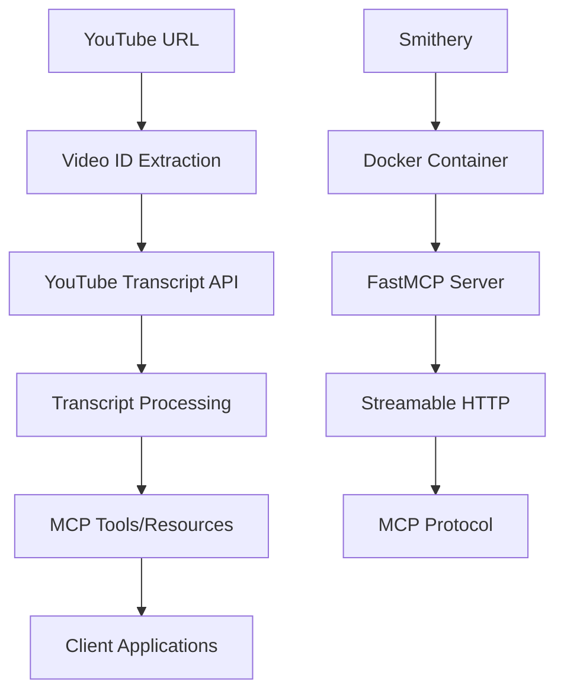

# YouTube Transcript MCP Server

A Model Context Protocol (MCP) server that provides tools and resources for fetching YouTube video transcripts. This server can be deployed to [Smithery](https://smithery.ai) or run locally.

## Features

### 🛠️ Tools
- **get_transcript**: Fetch transcript from YouTube video URL with language and timestamp options
- **extract_video_id_tool**: Extract video ID from various YouTube URL formats

### 📚 Resources  
- **youtube://transcript/{video_id}**: Get formatted transcript text by video ID
- **youtube://metadata/{video_id}**: Get transcript metadata (segments, languages, etc.)

### 💬 Prompts
- **analyze_transcript**: Structured prompt for analyzing video content
- **summarize_transcript**: Configurable prompt for summarizing videos (short/medium/long)

## Local Development

1. **Install dependencies:**
   ```bash
   uv sync
   ```

2. **Test the basic transcript fetcher:**
   ```bash
   uv run python main.py "https://www.youtube.com/watch?v=LBn0eAxQpb8"
   ```

3. **Run FastAPI server:**
   ```bash
   uv run uvicorn api_server:app --reload
   ```

4. **Test MCP server:**
   ```bash
   uv run mcp dev mcp_server.py
   ```

## Deployment to Smithery

### Prerequisites
- GitHub repository with this code
- Smithery account

### Deploy Steps

1. **Push to GitHub:**
   ```bash
   git add -A
   git commit -m "Ready for Smithery deployment"
   git push origin main
   ```

2. **Connect to Smithery:**
   - Go to [Smithery](https://smithery.ai)
   - Connect your GitHub repository
   - Navigate to the Deployments tab

3. **Configure deployment:**
   - The `smithery.yaml` file is already configured
   - Set any environment variables if needed
   - Click "Deploy"

### Configuration Options

The server supports these configuration parameters:

- **rateLimit**: API requests per minute (1-1000, default: 60)
- **languages**: Default transcript languages (default: "en") 
- **includeTimestamps**: Include timing info by default (default: true)
- **logLevel**: Logging verbosity (DEBUG/INFO/WARNING/ERROR, default: INFO)

## API Usage Examples

### Using Tools

```python
# Get transcript
result = await session.call_tool("get_transcript", {
    "url": "https://www.youtube.com/watch?v=LBn0eAxQpb8",
    "languages": "en,es",
    "include_timestamps": True
})

# Extract video ID
video_info = await session.call_tool("extract_video_id_tool", {
    "url": "https://youtu.be/LBn0eAxQpb8"
})
```

### Using Resources

```python
# Get transcript content
transcript = await session.read_resource("youtube://transcript/LBn0eAxQpb8")

# Get metadata
metadata = await session.read_resource("youtube://metadata/LBn0eAxQpb8")
```

### Using Prompts

```python
# Analysis prompt
analysis_prompt = await session.get_prompt("analyze_transcript", {
    "video_url": "https://www.youtube.com/watch?v=LBn0eAxQpb8"
})

# Summary prompt
summary_prompt = await session.get_prompt("summarize_transcript", {
    "video_url": "https://www.youtube.com/watch?v=LBn0eAxQpb8",
    "length": "medium"
})
```

## Architecture



## Error Handling

The server includes comprehensive error handling for:
- Invalid YouTube URLs
- Videos without transcripts
- Network connectivity issues
- Rate limiting
- Malformed requests

## Contributing

1. Fork the repository
2. Create a feature branch
3. Make your changes
4. Test locally with `uv run mcp dev mcp_server.py`
5. Submit a pull request

## License

MIT License - see LICENSE file for details.

## Support

- [MCP Documentation](https://modelcontextprotocol.io/)
- [Smithery Documentation](https://smithery.ai/docs)
- [YouTube Transcript API](https://github.com/jdepoix/youtube-transcript-api)
