# AI Power Infrastructure: The $5 Billion Speed Premium

## Executive Summary

**The Interconnection Latency Arbitrage** - The electric grid has become the primary bottleneck for AI infrastructure, not GPUs. While the market obsesses over NVIDIA chip supply, a quiet revolution is happening: hyperscalers are abandoning the grid entirely and building their own power plants.

### Key Thesis Points

1. **The Grid is Sold Out**: ERCOT alone has 78 GW of datacenter load requests vs 1.1 GW approved (70:1 ratio). The 5-7 year interconnection queue cannot serve AI's velocity.

2. **Speed is the Moat**: AI cloud revenue = $10-12M per MW annually. A 6-month delay on a 200MW datacenter = $1.2B in lost revenue. Elon Musk built a 100,000-GPU cluster in 4 months by bypassing the grid.

3. **The $5.2B Arbitrage**: Over 36 months, choosing onsite gas over grid power generates $5.2B more profit for a 200MW datacenter—purely from speed-to-revenue.

4. **BYOG is Structural**: 12+ suppliers now have >400MW of datacenter orders each. This is not a temporary bridge—it's the new normal for AI infrastructure.

5. **Hidden Monopolies**: Howmet Aerospace (HWM) controls the turbine blade supply chain. Every GE, Siemens, and Mitsubishi turbine needs Howmet's single-crystal nickel alloy castings.

---

## Table of Contents

1. [The Grid Bottleneck Crisis](#1-the-grid-bottleneck-crisis)
2. [BYOG Technology Landscape](#2-byog-technology-landscape)
3. [Manufacturer Deep Dive](#3-manufacturer-deep-dive)
4. [TCO Analysis & Economics](#4-tco-analysis--economics)
5. [Deployment Configurations](#5-deployment-configurations)
6. [Supply Chain Bottlenecks](#6-supply-chain-bottlenecks)
7. [Investment Thesis](#7-investment-thesis)
8. [Risk Factors](#8-risk-factors)
9. [Data Sources & Methodology](#9-data-sources--methodology)
10. [Charts Reference](#10-charts-reference)

---

## 1. The Grid Bottleneck Crisis

### The Numbers Don't Lie

The US electric grid was designed for a world without AI. In Texas alone, tens of gigawatts of datacenter load requests pour in each month—yet barely 1 GW has been approved in the past 12 months.

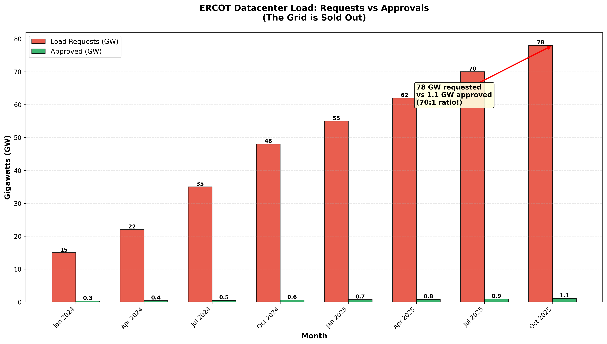

| Metric | Value | Source |
|--------|-------|--------|
| ERCOT datacenter requests (Oct 2025) | 78 GW | ERCOT LFLTF |
| ERCOT approvals (Oct 2025) | 1.1 GW | ERCOT LFLTF |
| Request-to-approval ratio | 70:1 | Calculated |
| Average interconnection time | 5-7 years | LBNL |

### Why the Grid Can't Keep Up

1. **Real-time balancing**: Electricity supply must match demand every second. A mismatch risks blackouts.
2. **System studies**: Every large load triggers engineering studies that now take years, not months.
3. **Prisoner's dilemma**: Speculative requests clog queues for everyone.
4. **Transmission bottlenecks**: 70% of AEP Ohio load requests don't even have land control.

### The Opportunity Cost of Waiting

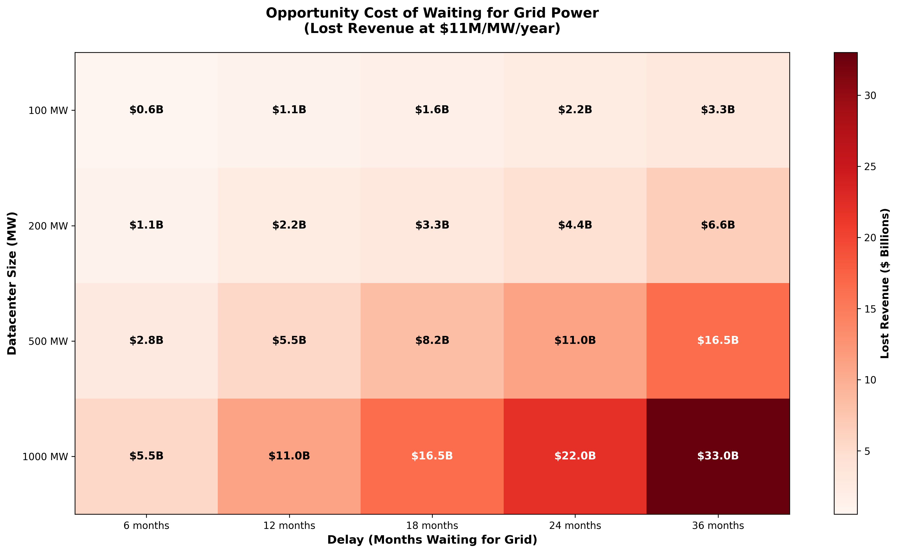

At $11M/MW/year in AI cloud revenue:
- 100 MW delayed 6 months = **$550M lost**
- 200 MW delayed 12 months = **$2.2B lost**
- 1 GW delayed 24 months = **$22B lost**

### AI Power Demand Explosion

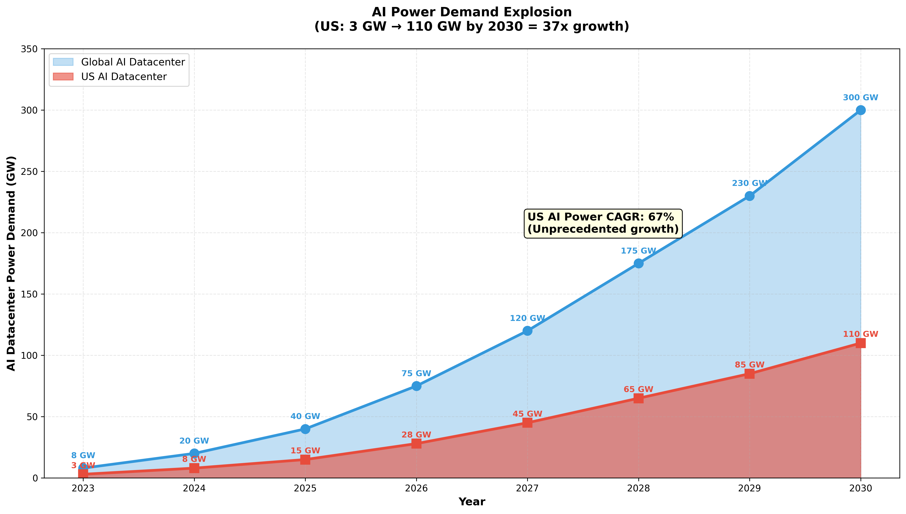

| Year | US AI Datacenter (GW) | Global AI Datacenter (GW) |
|------|----------------------|--------------------------|
| 2023 | 3 | 8 |
| 2024 | 8 | 20 |
| 2025 | 15 | 40 |
| 2026 | 28 | 75 |
| 2030 | 110 | 300 |

**US AI power CAGR: 67%** (unprecedented in infrastructure history)

---

## 2. BYOG Technology Landscape

Bring Your Own Generation (BYOG) is the answer to the grid bottleneck. Multiple technologies compete across the speed-cost-efficiency tradeoff.

### Technology Comparison Matrix

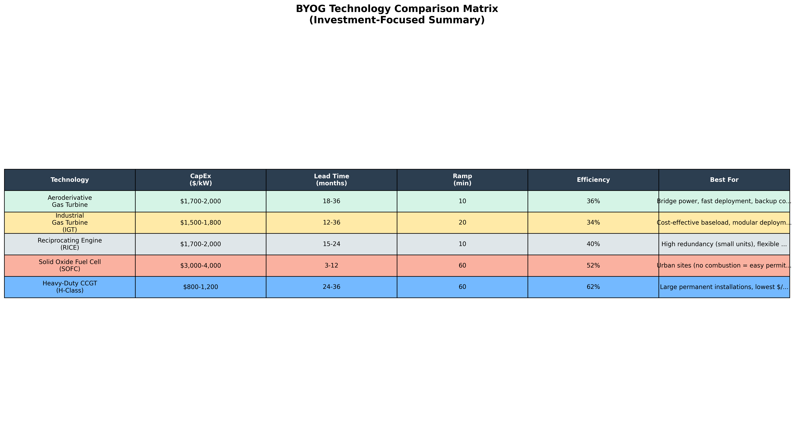

| Technology | CapEx ($/kW) | Lead Time | Ramp | Efficiency | Best For |
|------------|-------------|-----------|------|------------|----------|
| Aeroderivative | $1,700-2,000 | 18-36 mo | 10 min | 36% | Bridge power, backup |
| Industrial GT | $1,500-1,800 | 12-36 mo | 20 min | 34% | Cost-effective baseload |
| RICE | $1,700-2,000 | 15-24 mo | 10 min | 40% | High redundancy |
| Fuel Cell (SOFC) | $3,000-4,000 | 3-12 mo | 60 min | 52% | Urban, permitting-constrained |
| CCGT (H-Class) | $800-1,200 | 24-36 mo | 60 min | 62% | Large permanent installs |

### The Cost vs Speed Tradeoff

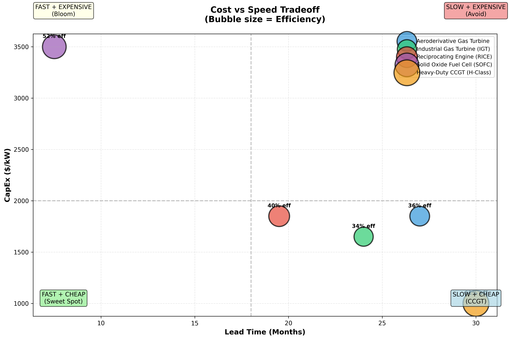

**Key Insight**: There is no "best" technology—only the right technology for each use case:

| Use Case | Winner | Runner-Up | Why |
|----------|--------|-----------|-----|
| Bridge Power (6-18 mo) | Aeroderivative | RICE | Fast deployment, backup conversion |
| Permanent Islanded (GW) | CCGT | IGT | Lowest TCO at scale |
| Urban/Permitting | Fuel Cell | RICE | No combustion = no EPA delays |
| High Redundancy | RICE | IGT | Small units = flexible N+1+1 |
| Emergency/Rental | Aeroderivative | RICE | Truck-mountable, rental available |

### Who Makes What

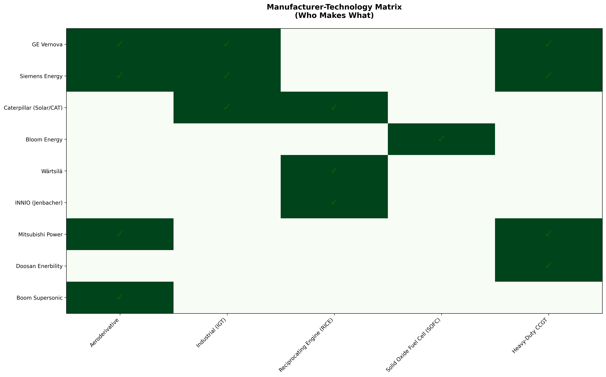

---

## 3. Manufacturer Deep Dive

### Market Share by 2025 Datacenter Orders

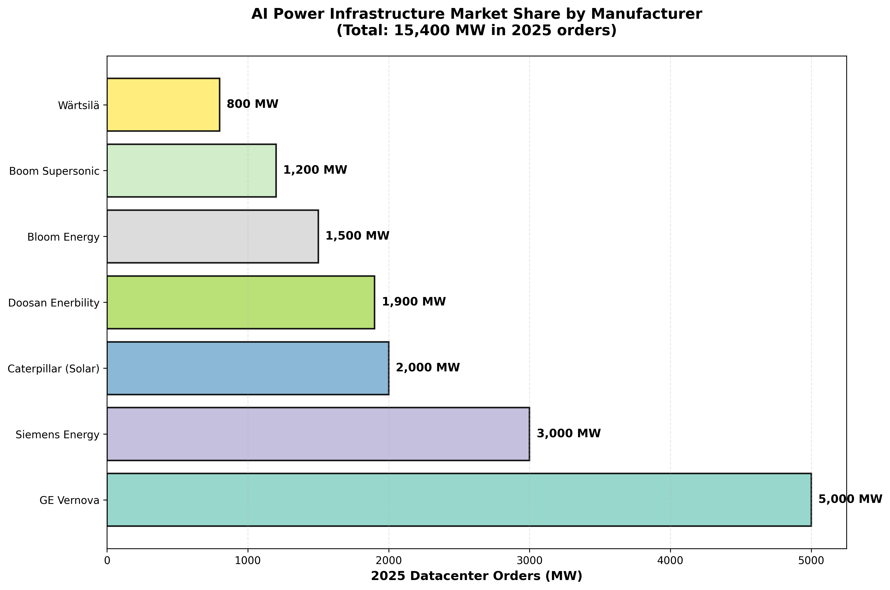

### GE Vernova (NYSE: GEV) — The Blue Chip

**2025 YTD Return: +100% | Market Cap: ~$100B**

| Metric | Value |
|--------|-------|
| Total Backlog | $135.3 billion |
| Slot Reservations | 62 GW |
| 2025 Datacenter Orders | ~5,000 MW |
| Capacity Target | 24 GW/year by 2026 |

**Key Win**: 29× LM2500XPRESS units for Crusoe/OpenAI (July 2025)

**Bull Case**: Pricing power, massive backlog, dividend doubled to $2/share, $10B buyback

---

### Bloom Energy (NYSE: BE) — The Permitting Arbitrage

**2025 YTD Return: +300% | Market Cap: ~$20B**

| Metric | Value |
|--------|-------|
| Production Capacity | 1 GW/year (ramping to 2 GW) |
| 2025 Datacenter Orders | ~1,500 MW |
| Key Deal | $5B Brookfield partnership (1 GW) |

**Key Win**: Oracle partnership for urban AI datacenters

**Bull Case**: No combustion = no air permitting delays. Fastest deployment. 4 consecutive record revenue quarters.

**Risk**: High CapEx ($3,000-4,000/kW), 5-6 year stack replacement cycle

---

### Howmet Aerospace (NYSE: HWM) — The Hidden Monopoly

**The "NVIDIA of Turbine Blades"**

Howmet is NOT a generator OEM—but every turbine sold needs Howmet's single-crystal nickel alloy blades and vanes.

| Metric | Value |
|--------|-------|
| Market Position | Near-monopoly on high-temp castings |
| Customers | GE Vernova, Siemens, Mitsubishi, Doosan |
| Supply Chain Risk | Rare earths (rhenium, yttrium, cobalt) |

**Bull Case**: Structural bottleneck. Every 1 GW of gas turbines sold = Howmet revenue. Pricing power.

---

### Other Key Players

| Company | Ticker | 2025 Orders | Bull Case |
|---------|--------|-------------|-----------|
| Caterpillar (Solar) | CAT | 2,000 MW | Diversified; doubling engine production |
| Siemens Energy | SMEGF | 3,000 MW | European champion; 30 GW/yr by 2030 |
| Wärtsilä | WRTBY | 800 MW | Marine-to-datacenter pivot |
| Boom Supersonic | PRIVATE | 1,200 MW | 1.2 GW Crusoe order; jet-to-turbine |
| Doosan Enerbility | 034020.KS | 1,900 MW | 1.9 GW xAI order; new H-class entrant |

---

## 4. TCO Analysis & Economics

### Total Cost of Ownership by Technology

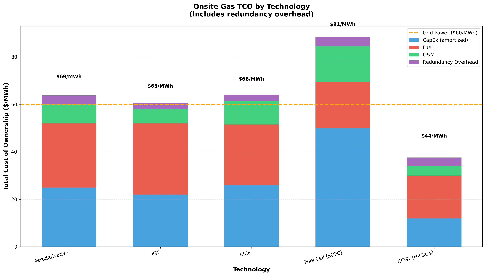

| Technology | CapEx | Fuel | O&M | Overhead | **Total TCO** |
|------------|-------|------|-----|----------|---------------|
| Aeroderivative | $25 | $27 | $8 | $4 | **$69/MWh** |
| IGT | $22 | $30 | $6 | $3 | **$65/MWh** |
| RICE | $26 | $25.5 | $10 | $3 | **$68/MWh** |
| Fuel Cell | $50 | $19.5 | $15 | $4 | **$91/MWh** |
| CCGT | $12 | $18 | $4 | $4 | **$44/MWh** |
| **Grid Reference** | — | — | — | — | **$60/MWh** |

**Key Insight**: Onsite gas is 5-50% more expensive than grid on a $/MWh basis—BUT the speed premium more than compensates.

### The 36-Month Arbitrage Model

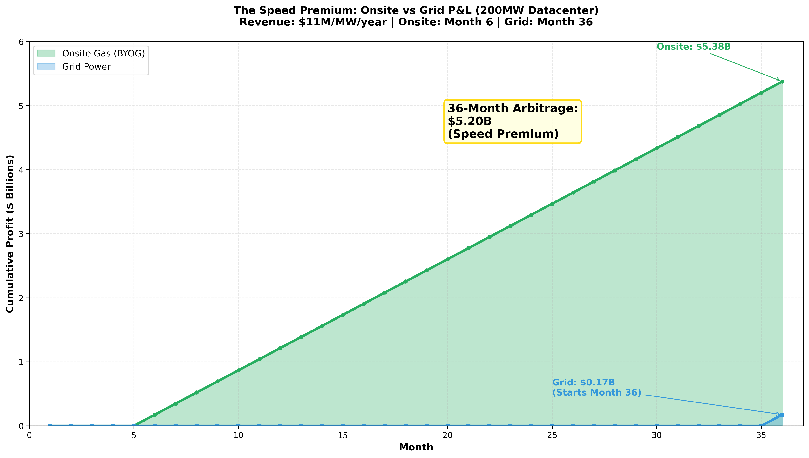

For a 200 MW datacenter at $11M/MW/year revenue:

| Scenario | Month 6 Profit | Month 36 Profit | Cumulative |
|----------|---------------|-----------------|------------|
| Onsite Gas | $173M/mo | $173M/mo | **$5.2B** |
| Grid Power | $0 (waiting) | $175M/mo | **$0.2B** |
| **Arbitrage** | — | — | **$5.0B** |

**The speed premium: $5.2 billion over 36 months.**

### Fuel Price Sensitivity

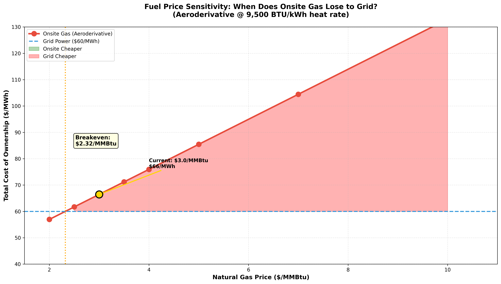

At current $3/MMBtu gas prices, onsite gas costs ~$69/MWh (vs $60 grid). Breakeven occurs around **$4.50-5.00/MMBtu**—still well above current prices.

---

## 5. Deployment Configurations

### Redundancy Matters

Datacenter uptime requirements demand N+1 or N+1+1 redundancy, adding 10-65% to generation capacity.

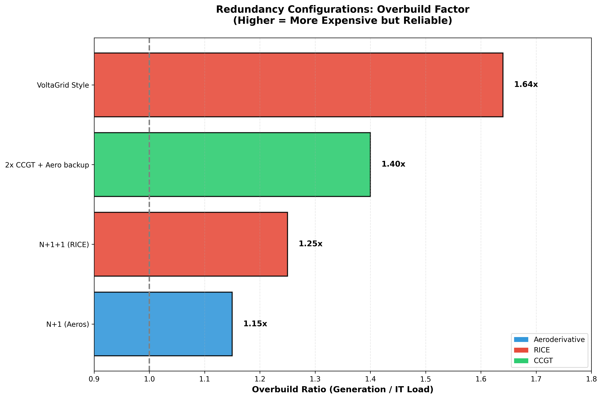

| Configuration | Overbuild | Example |
|---------------|-----------|---------|
| N+1 (Aeros) | 1.15x | 10× LM2500 for 300MW load |
| N+1+1 (RICE) | 1.25x | 50× Jenbacher for 180MW |
| 2× CCGT + Backup | 1.40x | 2× 400MW + 4× LM2500 |
| VoltaGrid Style | 1.64x | 2.3 GW for 1.4 GW datacenter |

### Real-World Deployments

| Project | MW | Location | Provider | Strategy |
|---------|-----|----------|----------|----------|
| xAI Colossus 1 | 150 | Memphis, TN | Solaris/VoltaGrid | Bridge power |
| xAI Colossus 2 | 500 | Memphis, TN | Solaris/Doosan | Permanent BYOG |
| Oracle/Crusoe Abilene | 2,300 | Abilene, TX | GEV/Solar | Bridge → Grid |
| Meta New Albany | 400 | Ohio | Williams/Mixed | Hybrid |
| Vantage Shackelford | 2,300 | Shackelford, TX | VoltaGrid | Permanent BYOG |

---

## 6. Supply Chain Bottlenecks

### The Real Constraint: Turbine Blades

Gas turbine blades require single-crystal nickel alloys with rare earths (rhenium, yttrium, cobalt, tantalum). Western production is concentrated in:

- **Precision Castparts (PCC)** — Berkshire Hathaway
- **Howmet Aerospace** — Public (HWM)
- **Consolidated Precision Products** — Private
- **Doncasters** — Private

**Critical Dependency**: Every GE, Siemens, and Mitsubishi turbine needs these castings. This is the true bottleneck.

### Manufacturer Capacity Ramp

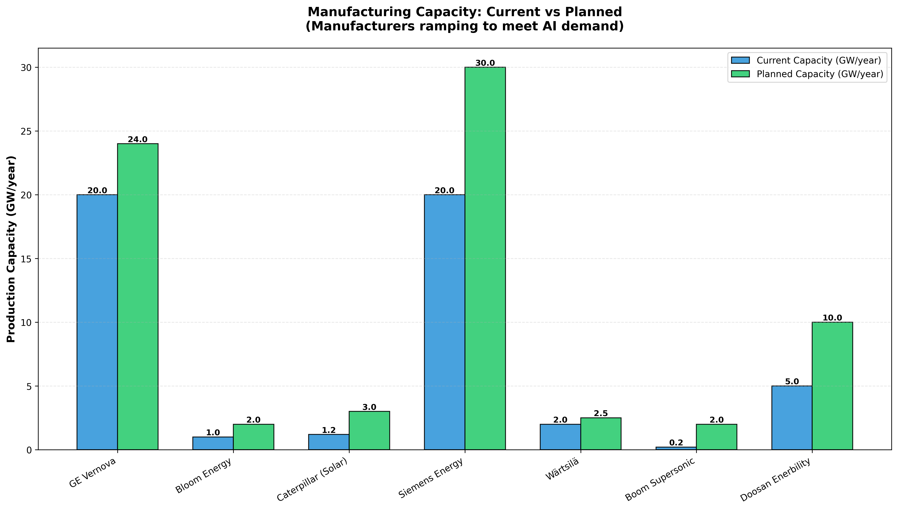

| Manufacturer | Current | Planned | Target Year |
|--------------|---------|---------|-------------|
| GE Vernova | 20 GW/yr | 24 GW/yr | 2026 |
| Siemens | 20 GW/yr | 30 GW/yr | 2030 |
| Caterpillar | 1.2 GW/yr | 3 GW/yr | 2030 |
| Bloom Energy | 1 GW/yr | 2 GW/yr | 2026 |
| Boom Supersonic | 0.2 GW/yr | 2 GW/yr | 2028 |

---

## 7. Investment Thesis

### Long-Only Portfolio

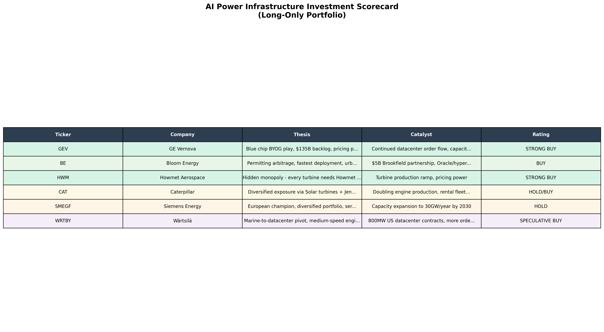

| Ticker | Company | Rating | Thesis |
|--------|---------|--------|--------|
| **GEV** | GE Vernova | STRONG BUY | Blue chip BYOG, $135B backlog |
| **BE** | Bloom Energy | BUY | Permitting arbitrage, fastest deployment |
| **HWM** | Howmet Aerospace | STRONG BUY | Hidden monopoly on turbine blades |
| **CAT** | Caterpillar | HOLD/BUY | Diversified via Solar/Jenbacher |
| **SMEGF** | Siemens Energy | HOLD | European champion, execution risk |
| **WRTBY** | Wärtsilä | SPECULATIVE | Marine pivot, limited capacity |

### 2025 YTD Performance

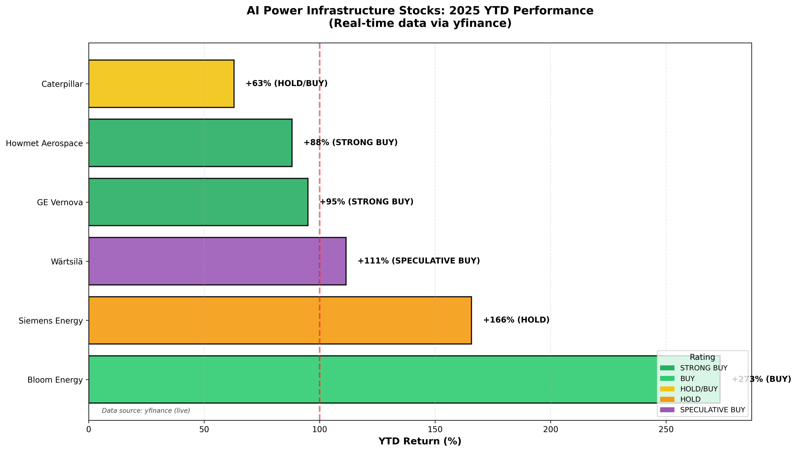

(Real-time data via yfinance)

### Market Cap Comparison

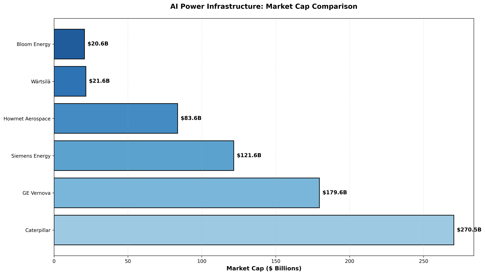

---

## 8. Risk Factors

1. **Natural Gas Volatility**: A spike to >$10/MMBtu would flip TCO advantage to grid.

2. **Regulatory Pivot**: FERC Order 2023 could accelerate interconnections, reducing BYOG value.

3. **Efficiency Gains**: 10,000x chip efficiency (Morgan Stanley) could reduce MW demand.

4. **Execution Risk**: New entrants (Boom, Doosan) have unproven track records.

5. **Rare Earth Supply**: China export controls on yttrium could impact blade production.

6. **Permitting Delays**: Even onsite gas requires EPA air permits (6-12 months).

7. **Interest Rates**: High rates increase CapEx burden for capital-intensive projects.

---

## 9. Data Sources & Methodology

### Primary Sources

- **SemiAnalysis**: "AI Datacenter Energy Dilemma" (March 2024), "How AI Labs Are Solving the Power Crisis" (Dec 2025)
- **ERCOT**: Large Flexible Load Task Force (LFLTF) reports
- **Lawrence Berkeley National Lab**: Interconnection queue studies
- **Company Filings**: GE Vernova, Bloom Energy, Siemens Energy 10-Ks and earnings calls
- **yfinance**: Real-time stock data for investment analysis

### Methodology

All Python scripts use:
- `matplotlib` for visualization
- `numpy` for calculations
- `yfinance` for real-time stock data
- JSON data files for structured storage

```bash
# Run all scripts
uv run python scripts/market_overview.py
uv run python scripts/equipment_comparison.py
uv run python scripts/manufacturer_analysis.py
uv run python scripts/tco_analysis.py
uv run python scripts/investment_thesis.py
```

---

## 10. Charts Reference

### Market Overview (01-04)
- `01_grid_bottleneck.png` - ERCOT load requests vs approvals
- `02_interconnection_timeline.png` - Years to power by generation type
- `03_ai_power_demand.png` - AI datacenter demand growth
- `04_opportunity_cost.png` - Revenue lost waiting for grid

### Equipment Comparison (05-08)
- `05_technology_comparison_table.png` - Tech specs matrix
- `06_cost_vs_speed_scatter.png` - CapEx vs lead time
- `07_technology_use_cases.png` - Best fit by scenario
- `08_manufacturer_technology_map.png` - Who makes what

### Manufacturer Analysis (09-12)
- `09_manufacturer_market_share.png` - 2025 datacenter orders
- `10_order_backlog.png` - Total backlog by manufacturer
- `11_production_capacity.png` - Current vs planned capacity
- `12_investment_summary.png` - Investment thesis table

### TCO Analysis (13-16)
- `13_tco_by_technology.png` - $/MWh breakdown
- `14_onsite_vs_grid_arbitrage.png` - 36-month P&L model
- `15_redundancy_costs.png` - Overbuild factors
- `16_fuel_sensitivity.png` - Gas price sensitivity

### Investment Thesis (17-20)
- `17_stock_performance_ytd.png` - Real-time YTD returns
- `18_arbitrage_cumulative_pnl.png` - Speed premium visualization
- `19_market_cap_comparison.png` - Relative sizing
- `20_investment_scorecard.png` - Rating summary

---

*Last updated: December 2025*

*Data sources: SemiAnalysis, ERCOT, LBNL, Company filings, yfinance*
