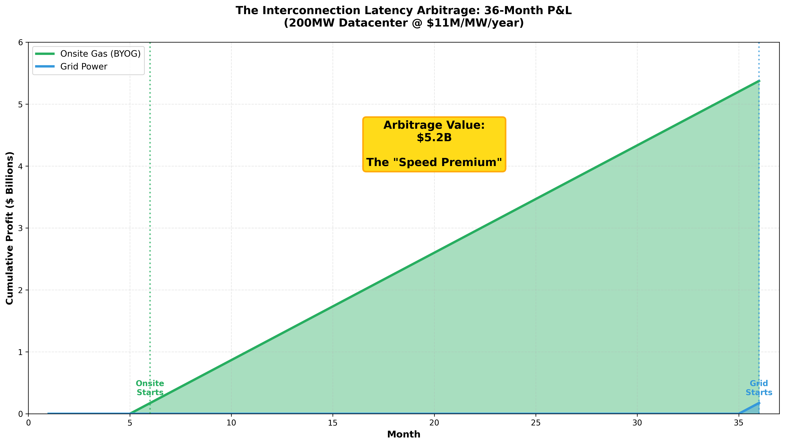
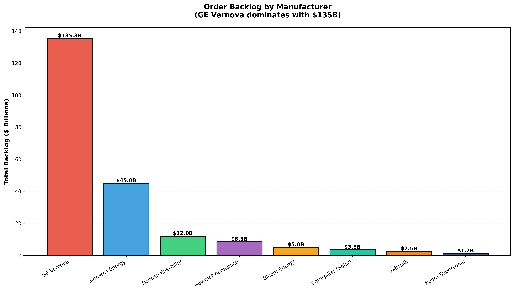

# The $5 Billion Speed Premium: Why AI Labs Are Abandoning the Grid

## Everyone's waiting for grid power. Elon built a 100,000-GPU cluster in 4 months. Here's the arbitrage.

---

## TL;DR

**Thesis:** Grid interconnection is the binding constraint on AI infrastructure, not GPUs. BYOG (Bring Your Own Generation) creates a $5.2B speed arbitrage over 36 months for a 200MW facility. This is structural, not temporary.

**The Setup:**
- ERCOT: 78 GW datacenter requests, 1.1 GW approved (70:1 ratio)
- Interconnection queue: 5-7 years
- AI power CAGR: 67% (3 GW → 110 GW by 2030)

**Positioning:**
| Ticker | Rating | Variant Perception |
|--------|--------|-------------------|
| **GEV** | STRONG BUY | Backlog understated; 62 GW slot reservations = 3+ years visibility |
| **HWM** | STRONG BUY | Misclassified as aerospace; actually AI infrastructure bottleneck |
| **BE** | BUY | Permitting arbitrage underappreciated; 3-12 mo vs 18-36 mo |
| **CAT** | HOLD | Diversified but Solar Turbines optionality not priced |
| **SEI** | TRADE | 30% SI, bridge power momentum, squeeze setup |

**Key Risk:** Gas >$10/MMBtu flips TCO. Currently at ~$3/MMBtu with forward curve flat.

---

## The Grid Bottleneck: Structural, Not Cyclical


### The Numbers That Matter

| Metric | Value | Source |
|--------|-------|--------|
| ERCOT datacenter load requests | 78 GW | ERCOT LFLTF Oct 2025 |
| ERCOT approved capacity | 1.1 GW | ERCOT LFLTF Oct 2025 |
| Request-to-approval ratio | **70:1** | Calculated |
| Average interconnection time | 5-7 years | LBNL Queue Study |
| AEP Ohio requests without land control | 70% | AEP Filing |

### Why This Isn't Fixable Soon

1. **Real-time balancing constraint**: Grid must match supply/demand every second. Large loads require extensive engineering studies.
2. **Prisoner's dilemma**: Speculative requests clog queues. 70% of AEP Ohio requests don't even have land control.
3. **Transmission bottleneck**: New generation requires new transmission. NIMBY + permitting = years.
4. **FERC Order 2023**: Intended to accelerate queues, but implementation takes 3-5 years. Current backlog doesn't disappear.


### Demand Trajectory

| Year | US AI Datacenter (GW) | YoY Growth |
|------|----------------------|------------|
| 2023 | 3 | — |
| 2024 | 8 | 167% |
| 2025 | 15 | 88% |
| 2026 | 28 | 87% |
| 2030 | 110 | 41% CAGR '26-'30 |

**Implication:** Even if FERC reforms cut queue times in half, demand growth outpaces supply additions by 10x+.

---

## The Arbitrage: $5.2B Over 36 Months



### Unit Economics

| Parameter | Value | Source |
|-----------|-------|--------|
| Datacenter size | 200 MW | Model assumption |
| Revenue per MW | $11M/year | Hyperscaler cloud pricing |
| Annual revenue | $2.2B | Calculated |
| Monthly revenue | $183M | Calculated |
| Gross margin (power cost adjusted) | ~95% | Industry standard |
| Monthly profit | ~$173M | Calculated |

### Scenario Analysis

| Scenario | Power Online | 36-Mo Cumulative Profit |
|----------|--------------|------------------------|
| **BYOG (Onsite Gas)** | Month 6 | $5.2B |
| **Grid Power** | Month 36 | $0.17B |
| **Arbitrage Delta** | — | **$5.0B** |

### Why This Matters

The market focuses on $/MWh comparisons:
- Grid: ~$60/MWh
- Onsite gas: $65-91/MWh (depending on technology)

**This is the wrong frame.** The relevant comparison is $65-91/MWh NOW vs. $0/MWh for 3+ years.

At $11M/MW/year revenue, a 6-month acceleration = $5.5M/MW. The CapEx premium for BYOG is $500-1,500/kW = $500K-1.5M/MW. **Payback on speed premium: 1-3 months.**

---

## Technology Stack: Decision Framework


### Detailed Comparison

| Technology | CapEx ($/kW) | Lead Time | Efficiency | Heat Rate | Ramp | Best Use Case |
|------------|-------------|-----------|------------|-----------|------|---------------|
| **Aeroderivative** | $1,700-2,000 | 18-36 mo | 36% | 9,500 BTU/kWh | 10 min | Bridge power, N+1 backup |
| **Industrial GT** | $1,500-1,800 | 12-36 mo | 34% | 10,000 BTU/kWh | 20 min | Cost-effective baseload |
| **RICE** | $1,700-2,000 | 15-24 mo | 40% | 8,500 BTU/kWh | 10 min | High redundancy (small units) |
| **Fuel Cell (SOFC)** | $3,000-4,000 | 3-12 mo | 52% | 6,500 BTU/kWh | 60 min | Urban/permitting-constrained |
| **CCGT H-Class** | $800-1,200 | 24-36 mo | 62% | 6,000 BTU/kWh | 60 min | Permanent GW-scale |


### TCO Analysis


| Technology | CapEx | Fuel | O&M | Overhead | **Total $/MWh** |
|------------|-------|------|-----|----------|-----------------|
| Aeroderivative | $25 | $27 | $8 | $4 | **$69** |
| Industrial GT | $22 | $30 | $6 | $3 | **$65** |
| RICE | $26 | $25.5 | $10 | $3 | **$68** |
| Fuel Cell | $50 | $19.5 | $15 | $4 | **$91** |
| CCGT | $12 | $18 | $4 | $4 | **$44** |
| Grid (reference) | — | — | — | — | **$60** |

**Key insight:** Fuel cells are 50% more expensive on $/MWh but 70% faster. For permitting-constrained sites, Bloom wins on NPV despite higher LCOE.

### Redundancy Overbuild

Datacenter uptime requirements demand N+1 or N+1+1 redundancy:

| Configuration | Overbuild Factor | Example |
|---------------|------------------|---------|
| N+1 (Aeros) | 1.15x | 10× LM2500 for 300MW load |
| N+1+1 (RICE) | 1.25x | 50× Jenbacher for 180MW |
| CCGT + Backup | 1.40x | 2× 400MW + 4× LM2500 |
| VoltaGrid Style | 1.64x | 2.3 GW for 1.4 GW datacenter |

---

## Investment Thesis: Stock-by-Stock


---

### GE Vernova (GEV) — STRONG BUY

**Variant Perception:** Market treats GEV as a traditional power equipment company. It's actually the toll road on AI infrastructure buildout.

| Metric | Value | Significance |
|--------|-------|--------------|
| Market Cap | ~$100B | — |
| YTD Return | +100% | Still running |
| Total Backlog | $135.3B | 3x revenue visibility |
| Slot Reservations | 62 GW | Not in backlog; upside to estimates |
| 2025 Datacenter Orders | ~5,000 MW | Accelerating |
| Capacity Target | 24 GW/year by 2026 | +20% from current |
| Dividend | $2/share (doubled) | Management confidence |
| Buyback | $10B authorized | Return capital at scale |

**Catalyst Calendar:**
- Q1 2026: Crusoe/OpenAI LM2500XPRESS deliveries begin (29 units)
- Ongoing: Datacenter order announcements (currently $500M+ quarterly)
- 2026: Capacity expansion completion

**Key Win:** 29× LM2500XPRESS units for Crusoe/OpenAI (July 2025). Mobile turbine generators purpose-built for rapid AI datacenter deployment.

**Valuation:** Trading at ~25x forward earnings. Historically 15-18x. Premium justified by:
1. Structural demand (grid can't catch up)
2. Pricing power (lead times extending)
3. Capital return acceleration

**Risk:** Execution on capacity ramp. Supply chain (Howmet blades).

---

### Howmet Aerospace (HWM) — STRONG BUY

**Variant Perception:** Classified as aerospace supplier. Actually a monopoly bottleneck on AI power infrastructure.

| Metric | Value | Significance |
|--------|-------|--------------|
| Market Cap | ~$50B | — |
| Position | Near-monopoly on high-temp castings | Only Western source at scale |
| Customers | GE, Siemens, Mitsubishi, Doosan | All turbine OEMs |
| Backlog | $8.5B | Understated; turbine demand pulls through |

**The Technical Moat:**

Every gas turbine requires blades that operate at 1,400°C+ while spinning at 3,600 RPM. These blades are made from single-crystal nickel superalloys with:
- Directional solidification (no grain boundaries)
- Internal cooling channels
- Thermal barrier coatings (EB-PVD)

Only two Western suppliers have this capability at scale:
1. **Howmet Aerospace** (public)
2. **Precision Castparts** (Berkshire, private)

**Supply Chain Logic:**
```
AI demand → Turbine orders → Blade casting demand → Howmet revenue
```

**Critical dependency:** GE Vernova's 62 GW slot reservations can only convert to revenue as fast as Howmet delivers castings. Every 1 GW of turbines = Howmet blade revenue regardless of which OEM wins.

**Rare Earth Exposure:**
- Rhenium (Chile, Kazakhstan)
- Yttrium (China 60%+)
- Cobalt (DRC, China processing)

China export controls = potential supply disruption. Howmet has been building inventory positions.

**Valuation:** ~30x forward. Aerospace multiple, not AI infrastructure multiple. Rerating potential if market recognizes the positioning.

---

### Bloom Energy (BE) — BUY

**Variant Perception:** High CapEx = bad. Wrong. Permitting speed = NPV positive despite higher LCOE.

| Metric | Value | Significance |
|--------|-------|--------------|
| Market Cap | ~$6B | Small cap, higher vol |
| YTD Return | +300% | Momentum |
| Production Capacity | 1 GW/year → 2 GW | Doubling |
| Key Deal | $5B Brookfield (1 GW) | Institutional validation |
| 2025 Datacenter Orders | ~1,500 MW | Accelerating |

**The Permitting Arbitrage:**

Bloom's solid oxide fuel cells have **no combustion**. This matters enormously:

| Permit Type | Gas Turbines | Bloom Fuel Cells |
|-------------|--------------|------------------|
| Air Quality (EPA) | Required | Not required |
| New Source Review | Required | Not required |
| Timeline | 12-36 months | 0 months |

In urban areas or non-attainment zones, permitting can add 2-3 years. Bloom deploys in 3-12 months.

**Economics at $3,500/kW:**
- CapEx: $700M for 200 MW
- Revenue: $2.2B/year
- Payback: <4 months (if alternative is waiting 2 years for permits)

**Risks:**
1. Stack replacement every 5-6 years (~$1,000/kW)
2. Lower efficiency than CCGT (52% vs 62%)
3. Natural gas price sensitivity

**Catalyst:** Oracle partnership for urban AI datacenters. More hyperscaler announcements expected.

---

### Caterpillar (CAT) — HOLD/BUY

**Variant Perception:** Market sees construction equipment. Solar Turbines optionality is free.

| Metric | Value |
|--------|-------|
| Market Cap | ~$175B |
| Solar Turbines | 1-23 MW industrial GTs |
| Jenbacher | RICE engines (now integrated) |
| 2025 Datacenter Orders | ~2,000 MW |
| Capacity Expansion | Doubling engine production |

**Bull Case:**
- Diversified exposure reduces risk
- Solar Turbines lead times shorter than GE aeros (12-24 mo vs 18-36 mo)
- Rental fleet leverage via Solaris partnership
- 2.5x turbine production by 2030

**Bear Case:**
- Not a pure-play
- Solar Turbines subscale vs GE Vernova
- Construction cycle exposure

**Positioning:** Moderate position. Defensive BYOG exposure.

---

### Solaris Energy Infrastructure (SEI) — SPECULATIVE/TRADE

**Variant Perception:** Bridge power is transitory. Yes, but the squeeze setup is real.

| Metric | Value |
|--------|-------|
| Short Interest | ~30% |
| Key Customer | xAI Colossus |
| Model | Rental fleet (Solar Titan/Saturn turbines) |
| Utilization | ~85% |

**Bull Case:**
1. Bridge power demand accelerating (everyone needs power NOW)
2. 30% SI = squeeze potential on positive news
3. Hyperscaler relationships sticky
4. Captures emergency CapEx at premium rates

**Bear Case:**
1. Rental power = commodity business
2. Once permanent generation online, equipment returned
3. Inherently transitory demand
4. Pricing power limited

**Positioning:** Small tactical position. Trade the momentum, don't marry the business model.

---




---

## Real-World Deployment Validation

| Project | MW | Location | Technology | Strategy | Status |
|---------|-----|----------|------------|----------|--------|
| xAI Colossus 1 | 150 | Memphis, TN | Solaris/VoltaGrid rental | Bridge power | Operational |
| xAI Colossus 2 | 500+ | Memphis, TN | Doosan DGT6 CCGT | Permanent BYOG | Construction |
| Oracle/Crusoe Abilene | 2,300 | Abilene, TX | GEV + Solar | Bridge → permanent | Development |
| Meta New Albany | 400 | Ohio | Williams/Siemens | Hybrid | Development |
| Vantage Shackelford | 2,300 | Shackelford, TX | VoltaGrid | Permanent BYOG | Development |

**Key observation:** xAI Colossus went from groundbreaking to 100,000-GPU operation in 4 months. Meta's comparable facility is still in interconnection queue.

---

## Risk Framework


### Quantified Risks

| Risk | Probability | Impact | Mitigation |
|------|-------------|--------|------------|
| Gas >$10/MMBtu sustained | Low (15%) | High | Long-term supply contracts; forward curve flat |
| FERC 2023 accelerates queues | Medium (30%) | Medium | 3-5 year implementation; backlog doesn't clear |
| Chip efficiency 10,000x | Low (10%) | High | Historically offset by capability expansion |
| China rare earth controls | Medium (25%) | Medium | Western diversification underway; inventory building |
| Execution (GEV capacity) | Medium (20%) | Medium | Slot reservations derisk; pricing power cushions |

### Scenario Analysis

| Scenario | Probability | GEV | HWM | BE |
|----------|-------------|-----|-----|-----|
| Base case (thesis plays out) | 50% | +50% | +40% | +30% |
| Bull case (demand accelerates) | 25% | +100% | +80% | +60% |
| Bear case (gas spike, demand slows) | 25% | -20% | -15% | -40% |
| **Expected Value** | — | **+43%** | **+36%** | **+18%** |

---

## The Bottom Line

**The new picks and shovels aren't chips. They're turbines.**

| Ticker | Company | Rating | Position Size | Key Thesis |
|--------|---------|--------|---------------|------------|
| **GEV** | GE Vernova | STRONG BUY | Core (5-8%) | Blue-chip BYOG, $135B backlog, 62 GW slot reservations |
| **HWM** | Howmet Aerospace | STRONG BUY | Core (4-6%) | Hidden monopoly, misclassified, rerating potential |
| **BE** | Bloom Energy | BUY | Meaningful (2-4%) | Permitting arbitrage, higher vol, higher reward |
| **CAT** | Caterpillar | HOLD/BUY | Moderate (1-2%) | Diversified, defensive, Solar optionality |
| **SEI** | Solaris Energy | TRADE | Tactical (0.5-1%) | Squeeze setup, momentum trade |

**The grid is sold out. BYOG is structural. The market is still pricing these as industrial equipment companies, not AI infrastructure bottlenecks.**

---


---

*Disclosure: This analysis is for informational purposes only and should not be construed as investment advice. Always conduct your own due diligence.*

*Data sources: SemiAnalysis, ERCOT LFLTF, Lawrence Berkeley National Lab, Company filings, yfinance*

*Last updated: December 2025*
