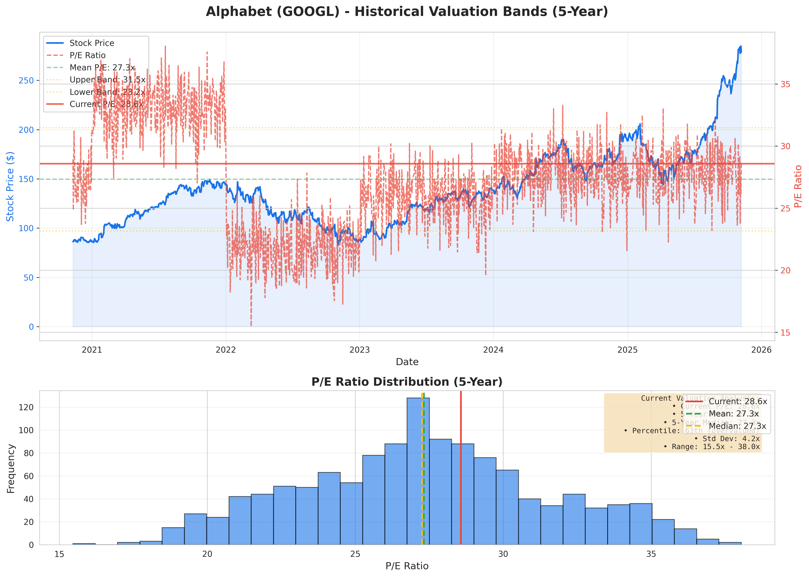
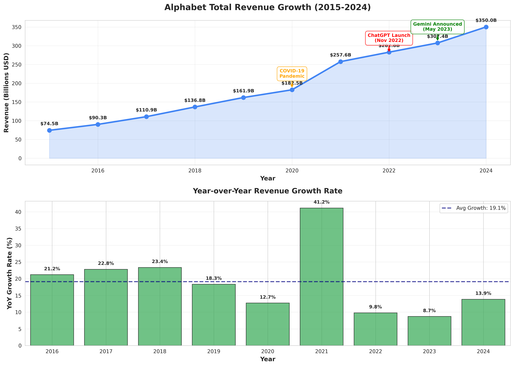
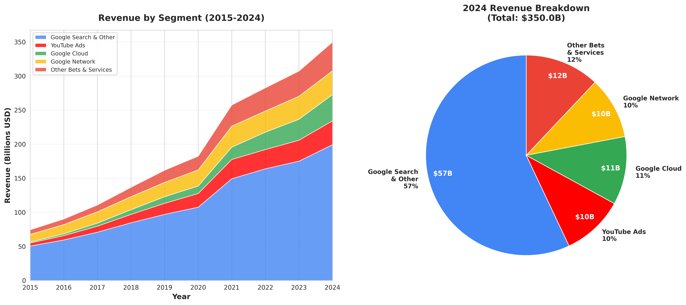
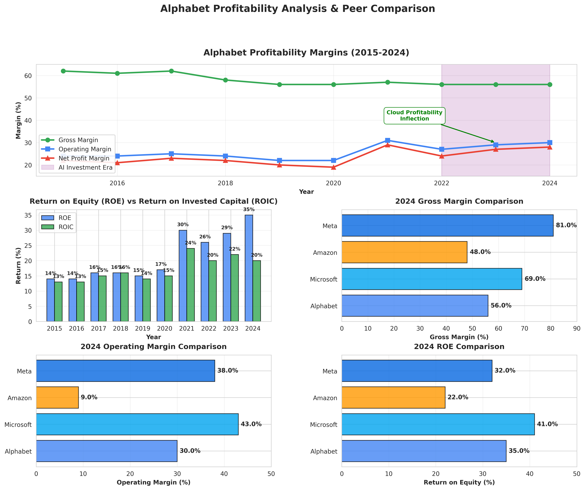
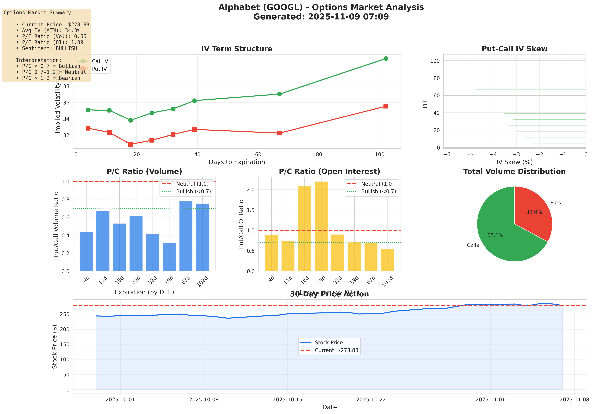

# Alphabet Inc. (GOOGL) - Investment Thesis

**Rating:** 🟢 STRONG BUY
**Price Target:** $340-360 (12mo) | $450-500 (3yr)
**Current Price:** $278.83 | **Upside:** 22-80%

**Analysis Date:** November 2025
**Market Cap:** $3.37 Trillion

---

## 💡 The Thesis in 60 Seconds

Alphabet is the **only company with all four pillars required for AI dominance**: leading AI models (Gemini), custom chips (TPUs), massive cloud infrastructure (Google Cloud), and distribution at scale (8 billion users).

Trading at **27.5x P/E** vs peer average of **38.5x** despite 35.5% ROE and $140B in annual earnings, the stock offers exceptional value for a quality compounder navigating the AI transition.

**The central question:** Can Google solve the innovator's dilemma - protecting its $200B search advertising business while building an AI-first future that may cannibalize it?

**Our answer:** Yes, with 60% probability. The combination of distribution moat, TPU cost advantages, cloud profitability inflection, and unmatched AI expertise provides multiple paths to success.

---

## 📊 Investment Snapshot

| Metric | Value | Assessment |
|--------|-------|------------|
| **Market Cap** | $3.37T | 4th largest globally |
| **P/E Ratio** | 27.5x | **Undervalued** vs 38.5x peers |
| **Revenue (2024)** | $350B | +14% YoY growth |
| **Operating Margin** | 30% | Best-in-class profitability |
| **ROE** | 35.5% | Exceptional capital efficiency |
| **Free Cash Flow** | $100B+ | Funds $92B CapEx comfortably |
| **Search Market Share** | 89.6% | Dominant but must defend 85%+ |
| **Cloud Revenue** | $50B | +30% growth, newly profitable |

---

## 🎯 Investment Scenarios

| Scenario | Probability | Target Price | Key Drivers |
|----------|-------------|--------------|-------------|
| **Bull Case** | 60% | $480 | Cloud dominates, AI monetization solved, Waymo scales |
| **Base Case** | 30% | $350 | Steady execution, search resilient, cloud grows 30%+ |
| **Bear Case** | 10% | $210 | Search disruption, regulatory breakup, talent exodus |

**Probability-Weighted Expected Value:** $363/share (+31% return over 2 years)

---

## 📚 Deep Dive Analysis

### Core Analysis
- **[Investment Recommendation →](sections/01_investment_recommendation.md)** - Entry/exit strategy, position sizing for different investor types
- **[Bull Case Analysis →](sections/05a_bull_case.md)** - $480 target scenario with Cloud dominance and AI monetization
- **[Bear Case Analysis →](sections/05b_bear_case.md)** - $210 downside scenario with search disruption and regulatory risks
- **[Financial Analysis →](sections/06_financial_analysis.md)** - Revenue projections, margins, cash flow, valuation (multiple frameworks)

### Strategic Deep Dives
- **[AI Thesis & Innovator's Dilemma →](sections/03_ai_thesis.md)** - Can Google protect search while building AI-first future?
- **[7 Powers Framework →](sections/04_seven_powers.md)** - Hamilton Helmer's moat analysis applied to Google
- **[Competitive Positioning →](sections/07_competitive_positioning.md)** - vs Microsoft, Amazon, Meta, OpenAI
- **[Strategic Initiatives →](sections/08_strategic_initiatives.md)** - Cloud, AI, Waymo execution analysis

### Reference & Risk Management
- **[Company Overview →](sections/02_company_overview.md)** - Business model, revenue segments, organizational structure
- **[Talent Dynamics →](sections/09_talent_dynamics.md)** - Key people, retention challenges, "transformer exodus"
- **[Acquisitions & M&A →](sections/10_acquisitions.md)** - Deal history, strategic rationale, antitrust constraints
- **[Risks & Mitigations →](sections/11_risks_mitigations.md)** - Regulatory, competitive, execution risks
- **[Metrics & KPIs →](sections/12_metrics_kpis.md)** - Tracking framework, red/green flags, sell signals

### Data & Methodology
- **[Appendix: Data & Charts →](sections/13_appendix_data.md)** - Sources, assumptions, visualization methodology

---

## 📈 Key Charts

### Valuation Analysis

**Key Finding:** Trading at 29% discount (27.5x P/E vs peer avg 38.8x) despite comparable fundamentals

**Valuation:** Current P/E at 63rd percentile (slightly above 5-year mean of 27.3x)

### Revenue & Profitability Trends

**Segment Breakdown (2024: $350B total)**

### Profitability & Margins

**Key Insight:** Operating margin expanded from 24% → 30% despite gross margin compression (Cloud mix shift)

### Strategic Investments

**2025 CapEx:** $92B (peak investment year) → Must show ROI by 2026-2027

### Competitive Analysis

**Cloud Growth:** $4B (2017) → $50B (2024) = 44% CAGR | Target: $110B by 2027

**Market Position:** Search declining slowly (89.6%), Cloud growing fast (14.0%), Browser dominant (68.8%)

### Options Market Sentiment

**Current Sentiment:** Bullish (P/C ratio: 0.56) | IV: 34.3% (slightly elevated vs realized 32.6%)

---

## 🎯 Key Takeaways

1. **Valuation Dislocation** - Trading at 27.5x P/E despite 35.5% ROE and 14% growth (peers: 38.5x)
2. **Complete AI Stack** - Only company with models + chips + cloud + distribution at scale
3. **Cloud Inflection** - First annual profit in 2024, margins expanding toward AWS levels (13% → 25%+ target)
4. **Search Resilience** - 18% revenue CAGR over 9 years despite "search is dying" narratives
5. **Capital Allocation** - $70B buybacks + $11B dividend + $92B CapEx = returning cash while investing
6. **Key Risk** - Can Google monetize AI search without cannibalizing $200B advertising business?

---

## 🚦 Investment Decision Framework

### Position Sizing Recommendation
- **Core Position:** 5% of portfolio at current levels ($278)
- **Add to 8%:** On pullback below $260 (attractive entry)
- **Trim:** Above $360 to rebalance (target reached)

### Quarterly Monitoring Checklist
- [ ] Revenue growth >12% (warning if <10%)
- [ ] Search market share >87% (crisis if <85%)
- [ ] Cloud operating margin >15% (profitability inflection)
- [ ] Free cash flow >$40B/quarter (CapEx sustainable)
- [ ] Talent retention stable (track DeepMind attrition)

### Immediate Sell Triggers
1. Search market share drops below 80%
2. Revenue growth <5% for 2 consecutive quarters
3. Cloud operating margin turns negative
4. CEO/CFO departure
5. Material cybersecurity breach

---

## 📖 How to Use This Analysis

**For Quick Decision (5 min):**
- Read this page + [Investment Recommendation](sections/01_investment_recommendation.md)

**For Due Diligence (30 min):**
- Add [Bull Case](sections/05a_bull_case.md), [Bear Case](sections/05b_bear_case.md), [Risks](sections/11_risks_mitigations.md)

**For Deep Research (2 hrs):**
- Read [Financial Analysis](sections/06_financial_analysis.md), [Competitive Positioning](sections/07_competitive_positioning.md), [7 Powers](sections/04_seven_powers.md)

**For Ongoing Monitoring:**
- Track [Metrics & KPIs](sections/12_metrics_kpis.md) quarterly

---

## 🔗 Additional Resources

- **Data Sources:** Yahoo Finance, Google Investor Relations, Acquired Podcast (AI history deep dive)
- **Charts Generated:** See `/charts` directory for PNG/SVG versions
- **Raw Data:** See `/data` directory for CSV files (acquisitions, talent moves)
- **Scripts:** See `/scripts` directory for data fetching and chart generation code

---

## 📝 Document Information

**Last Updated:** November 2025
**Analyst:** [Your Name]
**Total Word Count:** 22,000+ words across all sections
**Original Full Document:** [README_original.md](README_original.md) (archived for reference)

---

**Disclaimer:** This is not investment advice. Conduct your own research and consult with a qualified financial advisor before making investment decisions.
