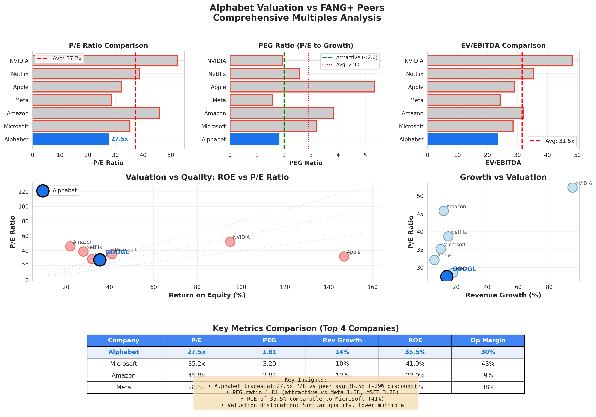
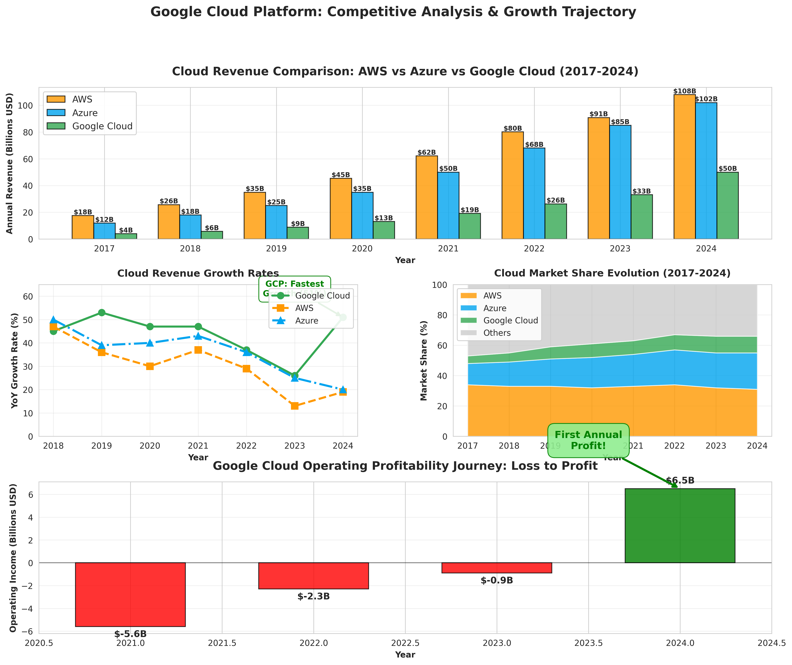
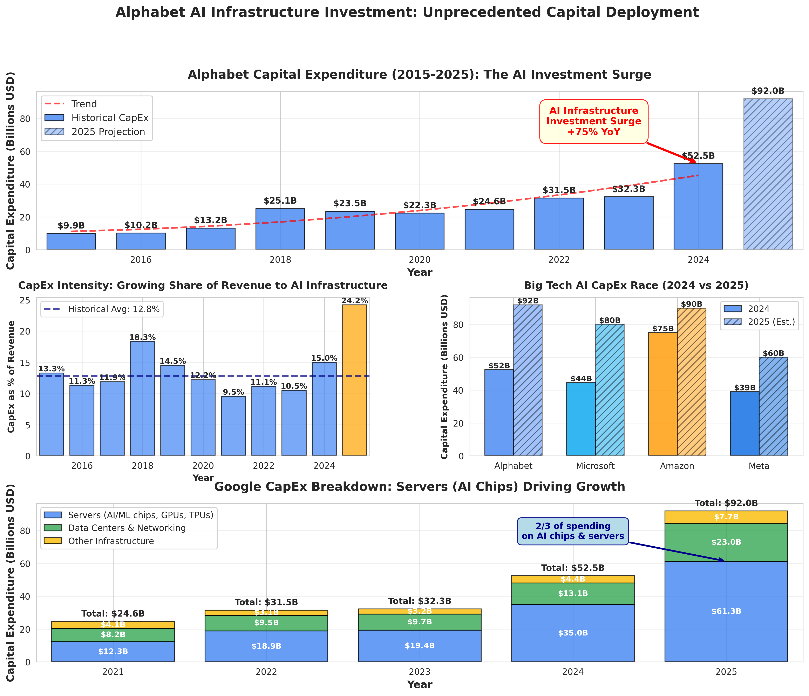
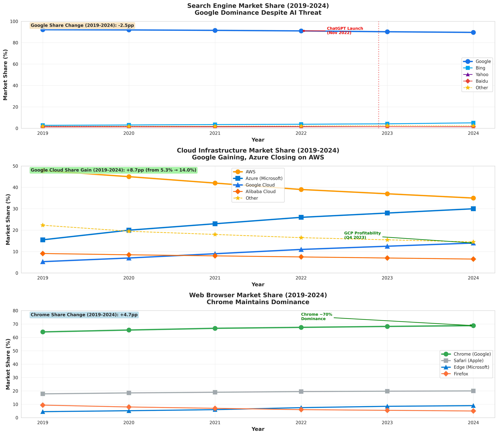

# Why I'm Buying Google (Despite the AI Panic)

**An investment thesis on Alphabet's hidden advantages**

*November 2025*

---

## The Realization

I was listening to the Acquired podcast's Google AI episode ([summary here](https://github.com/ykdojo/youtube-summarizer-mcp/blob/main/summaries/google_ai_innovators_dilemma_transformer_origins_to_gemini.md) | [Spotify](https://open.spotify.com/show/7Fj0XEuUQLUqoMZQdsLXqp)) and something clicked:

**Google has zero real AI competition.**

Not "they're competitive." Not "they have advantages." **They have no peer with the complete stack.**

Think about what they actually have:
- **Talent**: OG LLM researchers (invented transformers)
- **Models**: Gemini at scale (1 quadrillion tokens/quarter)
- **Data**: Search, YouTube, Gmail, Maps - proprietary datasets nobody else has
- **Chips**: TPUs with 50%+ cost advantage vs Nvidia GPUs
- **Infrastructure**: GCP at $50B revenue, newly profitable
- **Distribution**: 8 billion users across properties
- **Money**: $140B in annual earnings to fund the transition

This isn't "maybe they can compete." This is "how does anyone else catch up?"

OpenAI and Anthropic exist because of Google's research. The transformer paper came from Google Brain. They're now in code red - best engineers funneled directly into Gemini.

The market thinks Google is late. I think they're the only company that has everything needed to win.

And the stock trades at a **29% discount** to peers.

## Why AI Models Need Everything (Not Just Smarts)

Here's what most people miss: **AI models are hardware-dependent.**

If throwing more compute at a model makes it better (and it does), then whoever controls the cheapest, largest compute infrastructure wins. It's not about having smart researchers in a garage. It's about production scale.

This is why:
- OpenAI depends on Microsoft's Azure (no infrastructure)
- Anthropic depends on AWS/GCP (no chips, no cloud)
- Meta gives models away (can't monetize without distribution)

**Google is the only company with all four pillars:**

### 1. Leading Models (Gemini)

Yes, they launched 13 months after ChatGPT. But here's what matters:

Gemini 2.5 Pro is now competitive with GPT-4o and Claude 3.5 on benchmarks. More importantly, they're processing **1 quadrillion tokens per quarter** (up 100x in 14 months). That's production scale nobody else has.

And multimodal from day one. Gemini understands text, images, video, audio, and code natively. ChatGPT is still catching up.

### 2. Custom Chips (TPUs)

This is the advantage nobody talks about.

**The economics:**
- Nvidia H100 GPU: $35,000 per chip (80% margin to Nvidia)
- Google TPU v5: ~$15,000 (50% margin to Broadcom)

When you're building clusters of 10,000+ chips, that 57% cost advantage is **massive**.

OpenAI pays Nvidia $350M for a 10K GPU cluster. Google pays $150M for equivalent TPU compute. That's $200M in savings per cluster.

In an industry running 50% gross margins (not 80% like traditional software), **being the low-cost producer actually matters**.

Google has 2-3 million TPUs deployed globally. That's comparable to Nvidia's entire annual GPU shipments. They're effectively the #2 AI chip company, and most investors don't realize it.

### 3. Cloud Infrastructure at Scale

Google Cloud just hit profitability. $50B in revenue, $6.5B in operating income, growing 30% year-over-year.

This is a new story. For years, Cloud was "the drag on margins." Now it's:
- 13% operating margin (targeting 25%+ like AWS)
- Fastest growth among top 3 cloud providers
- **142% YoY operating income growth in Q4 2024**

Revenue path: $4B (2017) → $50B (2024) → $110B (2027 target). That's a 44% CAGR.

If they hit AWS-level margins (25%) by 2027, that's $25B in operating income from Cloud alone. At 15x, that's $375B in value that's barely reflected in today's stock price.

### 4. Distribution (8 Billion Users)

ChatGPT has 200M users. Impressive.

Google has:
- 8B users globally across products
- 8.5B search queries per day
- 3.5B Chrome users (65% browser share)
- 3B Android devices (70% mobile OS)
- 2.7B YouTube users
- 1.8B Gmail users

Even if OpenAI's models are better (debatable), **Google can deploy to 40x more users instantly**.

They rolled out AI Overview to billions in a single month. No app install. No user action required. Just billions of people experiencing AI in their search results.

Network effects compound when you have this much distribution.

## The Waymo Wild Card

One more thing from that podcast: **full self-driving hits all at once in 2027.**

Waymo is operating in 5 cities now. Tokyo expansion coming. If you've taken a Waymo, you know: the experience is just better. Private. No small talk. No aggressive driving. 91% fewer crashes than humans.

When this scales:
- No more Uber/Lyft drivers
- $470B annual crash costs in the US → $420B saved (if 90% reduction)
- Potential $100B+ business that's currently valued near zero in Google's stock

This is pure optionality. Bull case doesn't need it. But if it works, it's massive.

## The Bull Case: Three Paths to $480

I see three scenarios where this works, with different probability weights:

### Scenario 1: Cloud Dominance (60% probability)

Google Cloud hits $110B revenue by 2027 with 25% operating margins.

The math:
- Operating income: $27.5B
- At 15x (SaaS multiple): **$412B value**
- Currently valued at ~$150B in sum-of-parts models
- **Upside: $250B+ ($19/share)**

Why this happens: TPU cost advantage + enterprise AI workloads + multi-cloud strategy (Anthos). Thomas Kurian has already proven execution (took Cloud from $4B to $50B in 6 years).

### Scenario 2: Search + AI Integration (70% probability)

The bear case says AI destroys search ads. I think that's wrong.

Early data from AI Overview shows:
- Session duration **+15%** (longer engagement)
- Click-through rates maintained (not zero-click problem)
- Ad units testing in AI responses (working)

**Search revenue has grown 18% CAGR over 9 years** despite endless "Google search is dying" narratives.

I think search grows 6-8% annually through 2027. Combined with Gemini subscriptions (targeting 25M+ users at $20/month), that's $215B from search/AI vs $200B today.

The hybrid model works: AI answers + maintained monetization.

### Scenario 3: TPU Moat = AI Market Share (50% probability)

Google can price AI inference 30-40% cheaper than OpenAI and maintain better margins.

If this plays out:
- Gemini API takes 30%+ market share (price advantage)
- Enterprise customers choose GCP + Gemini bundle (vs Azure + OpenAI)
- Free tier drives 500M+ Gemini users
- 2027 AI revenue: $30B at 40% margins = $12B operating income

**Combined bull case:** Cloud ($27B) + Search/AI ($140B) + other businesses → $200B+ in operating income by 2027. At 32x (re-rated as AI company), that's **$6.4T market cap = $480/share**.

Probability-weighted: I give this ~35% chance of hitting the full bull case, 60% chance of hitting 70-80% of it.

## The Bear Case: What Actually Keeps Me Up

I'm bullish on Google, but these risks are real:

### Risk 1: Search Revenue Cliff

If AI chat truly destroys the search advertising model faster than Google can adapt, this goes badly.

The math that scares me:
- Current US user: $400/year in search ad revenue
- ChatGPT-style chat: $240/year subscription (40% less)
- But power users generating $1000+/year in ads might pay $20/month
- **That's trading $1000 for $240 = -76% revenue**

If search revenue drops 30%+ by 2027 instead of growing, that's $60B in lost revenue. Even with Cloud growth, that's catastrophic for margins.

I put 10% odds on the severe version of this (search down 50%+), 30% on moderate version (search down 20-30%).

### Risk 2: Talent Exodus

All eight transformer paper authors left Google. That's not a coincidence.

Recent data point: Microsoft just hired 24+ DeepMind researchers in Q2 2025. Google had to pay $2.7B to bring back Noam Shazeer (one of the transformer inventors).

If Gemini falls behind GPT-5/Claude 4 in 2026 because the best researchers keep leaving, the whole AI thesis breaks. Google Cloud AI revenue stalls. Enterprise picks OpenAI/Anthropic.

This is hard to quantify but it's a **real execution risk**.

### Risk 3: Regulatory Breakup

DOJ ruled Google is a monopoly. Remedies hearing in Q2 2025.

Worst case: Chrome divestiture. That's 30-40% of search traffic and massive targeting data loss. Could be $100B in annual revenue impact.

More likely: ban on default search deals (lose $30B in traffic acquisition costs but $36B in associated revenue) + Android choice screens (20-25% market share loss).

Probability-weighted impact: ~$20-30B in value destruction, but spread over 3-5 years due to appeals.

**Combined bear case:** Search down 30%, Cloud commoditizes at 15% margins, regulatory remedies hit. Revenue $410B (vs $510B bull), operating margins 24% (vs 31% bull), earnings at 18x (vs 32x) = **$1.53T market cap = $115/share**.

I put 10% odds on full bear case, 30% on partial bear.

## The Numbers: What the Market is Missing

Let me show you four charts that tell the story:

### Valuation Dislocation

*Source: [GitHub - Data & Charts](https://github.com/ykdojo/youtube-summarizer-mcp/tree/main/deep_dives/Google/charts)*

**Google is trading at 27.5x P/E vs peer average of 38.8x. That's a 29% discount.**

For a company with:
- 35.5% ROE (best-in-class)
- 14% revenue growth (faster than Microsoft)
- 30% operating margins (top-tier)
- $140B in annual earnings (more than any tech company)

This makes no sense. The market is pricing in permanent search decline that I don't think is coming.

### Cloud Inflection

*Source: [GitHub - Data & Charts](https://github.com/ykdojo/youtube-summarizer-mcp/tree/main/deep_dives/Google/charts)*

Look at that trajectory. $4B → $50B in 7 years. And now profitable.

AWS took 6 years to reach profitability (2006-2012). Google Cloud did it in similar timeframe but with much tougher competition. The Thomas Kurian enterprise sales transformation is real.

### The CapEx Commitment

*Source: [GitHub - Data & Charts](https://github.com/ykdojo/youtube-summarizer-mcp/tree/main/deep_dives/Google/charts)*

**$92B in 2025 CapEx. That's 26% of revenue.**

This is both the bull and bear case. Bull: shows absolute commitment to winning AI. Bear: what if these returns don't materialize?

I think the TPU cost advantage makes this ROI positive by 2026-2027. But it's a real execution risk.

### The Moat

*Source: [GitHub - Data & Charts](https://github.com/ykdojo/youtube-summarizer-mcp/tree/main/deep_dives/Google/charts)*

Search declining slowly (89.6%), but still dominant. Cloud growing fast (11% → 14%+ share). Chrome at 68.8%.

The moat is eroding in search but **building in cloud and AI**. This is portfolio rotation, not portfolio destruction.

## Bottom Line: What I'm Doing

**Position sizing:**
- **Core position: 5-7% of portfolio at current levels ($278)**
- Add on pullbacks below $260 (up to 10%)
- Trim above $360 (12-month target)

**My conviction: 8/10**

Why not higher? The talent exodus and search cannibalization risks are real. This requires execution on multiple fronts.

But here's why I'm comfortable:

1. **29% valuation discount** = significant margin of safety
2. **Four pillars advantage** = multiple paths to success (don't need all to work)
3. **Cloud profitability inflection** = new earnings driver already proving out
4. **$105B net cash** = financial fortress, can weather years of transition
5. **TPU cost moat** = sustainable advantage in 50% margin AI world

**Probability-weighted expected return: +15%/year over 3 years**

That's excellent for a quality compounder with multiple growth drivers.

---

## For the Ultra-Deep Dive

If you want the full 22,000-word analysis with:
- Complete financial models (DCF, sum-of-parts, comparable company)
- 7 Powers framework analysis
- Detailed competitive positioning
- Quarterly monitoring checklist
- Red flag / green flag framework

**[Check the full report on GitHub](https://github.com/ykdojo/youtube-summarizer-mcp/tree/main/deep_dives/Google)**

All data sources, assumptions, and chart generation code are there too.

---

## What I'm Watching

**Green flags** (add to position):
- [ ] Cloud operating margin >20% (profitability acceleration)
- [ ] Gemini wins blind tests vs GPT/Claude (technical leadership)
- [ ] Search revenue growing despite AI (thesis validated)
- [ ] Waymo reaches profitability (optionality paying off)

**Red flags** (reduce/exit):
- [ ] Search market share <85% (structural disruption)
- [ ] Revenue growth <5% for 2 consecutive quarters (secular decline)
- [ ] Cloud operating margin turns negative (regression)
- [ ] Multiple quarters of Gemini benchmarks falling behind

Quarterly updates as this develops.

---

*Disclaimer: This is not investment advice. Do your own research.*

**Data sources:**
- Yahoo Finance, Google Investor Relations, company filings
- [Acquired Podcast - Google AI Episode](https://www.acquired.fm/) ([summary](https://github.com/ykdojo/youtube-summarizer-mcp/blob/main/summaries/google_ai_innovators_dilemma_transformer_origins_to_gemini.md))

**Charts & models:** [Available on GitHub](https://github.com/ykdojo/youtube-summarizer-mcp/tree/main/deep_dives/Google)

---

*What do you think? Am I missing something on the bear case? Let me know in the comments.*
