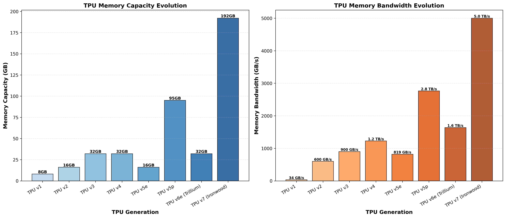
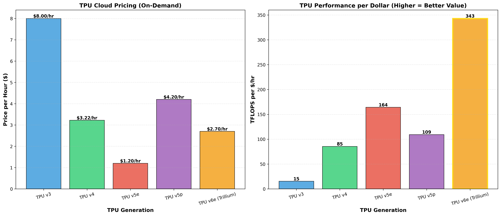
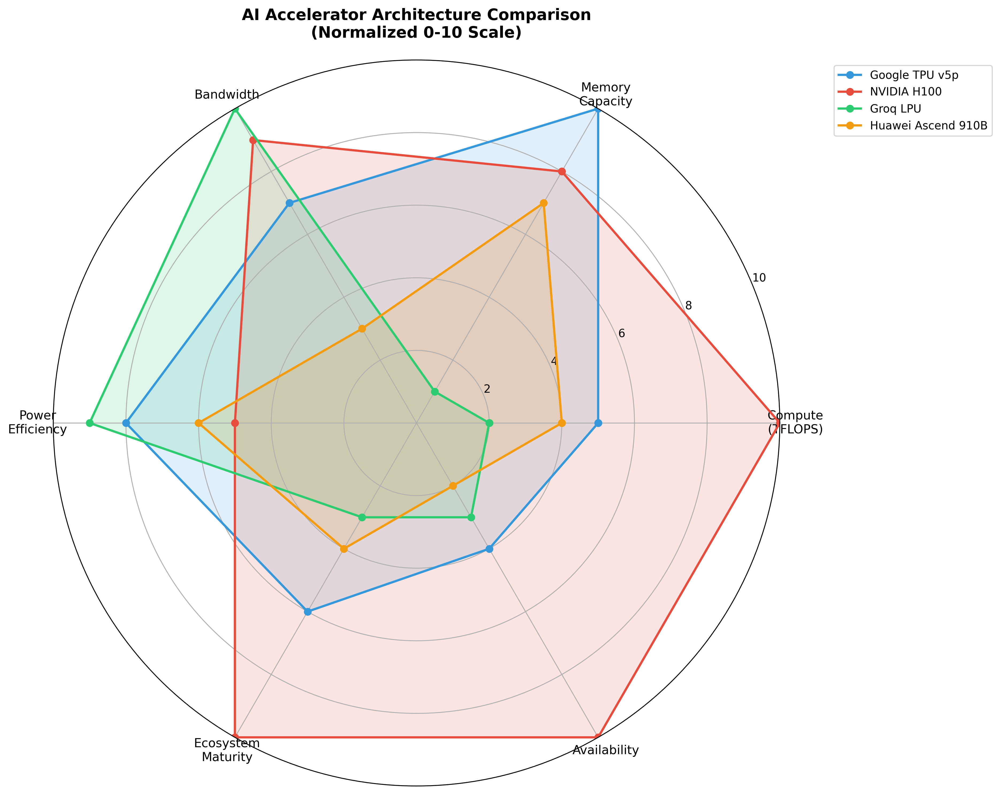
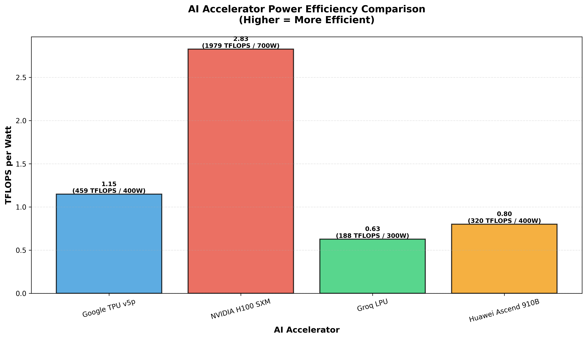
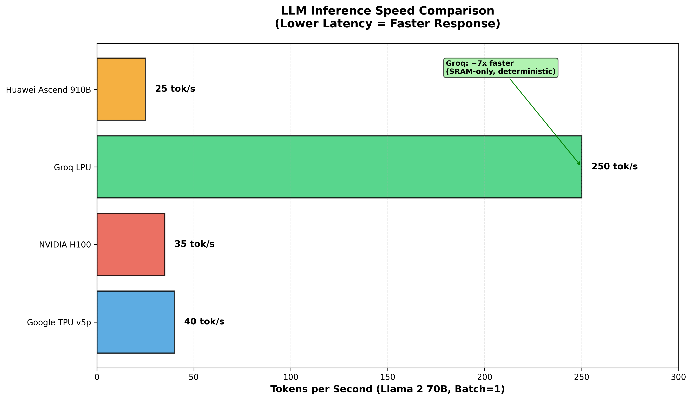
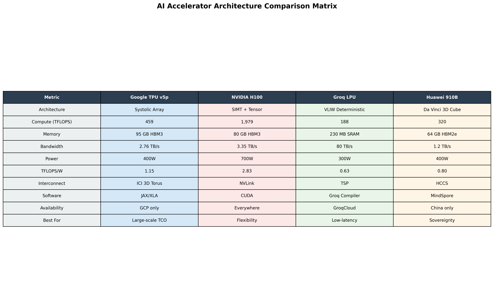
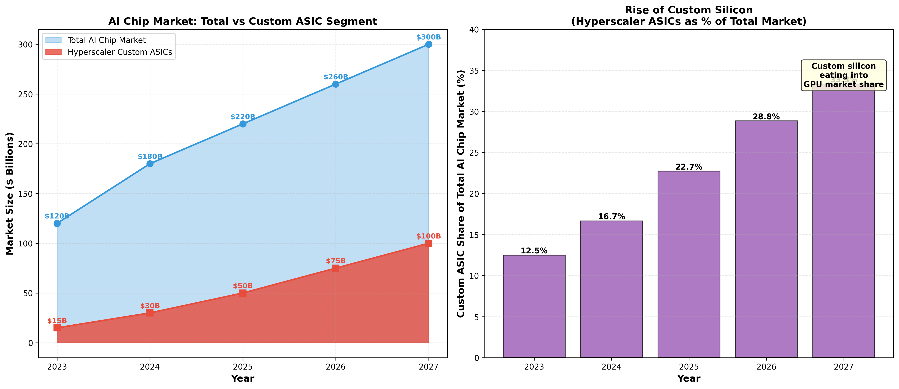
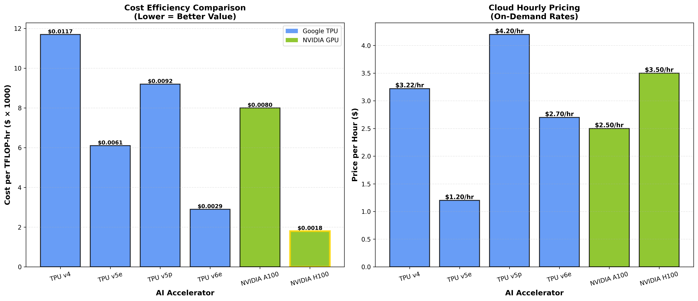

# The Silicon Sovereign: Google TPU Architecture, Supply Chain, and Investment Analysis

## Executive Summary

Google's Tensor Processing Unit (TPU) represents one of the most significant strategic bets in modern computing: a hyperscaler building its own custom silicon to escape NVIDIA's grip and create an unassailable cost moat.

**Key Thesis Points:**

1. **Vertical Integration Moat**: Google runs Search, YouTube, Gmail, and Gemini on **zero NVIDIA GPUs**—avoiding tens of billions in Capex and NVIDIA's 75% gross margins
2. **The "GPU-Poor" Advantage**: TPU v5e delivers **2.7x better performance per dollar** than v4, making Google "GPU-Rich" in its own currency
3. **Broadcom is #2**: Broadcom's AI revenue ($11-12B in 2024) makes it the **second-largest AI chip company by revenue** behind only NVIDIA—mostly from Google TPU
4. **74% Market Dominance**: Google owns **74% of the cloud ASIC accelerator market** (vs AWS Trainium/Inferentia at 18%)
5. **The MediaTek Shift**: Google is diversifying supply chain for TPU v7 (Ironwood), reducing Broadcom dependency

**The Contrarian Take**: While investors chase NVIDIA, the real story is Google building silicon sovereignty—and Broadcom quietly becoming AI's second-largest beneficiary.

---

## Table of Contents

1. [The Origin Story: Why Google Built Custom Silicon](#1-the-origin-story)
2. [Architectural Deep Dive: The Physics of the Systolic Array](#2-architecture-deep-dive)
3. [Generational Evolution: TPU v1 to v7 Ironwood](#3-generational-evolution)
4. [Competitive Landscape: TPU vs GPU vs Groq vs Huawei](#4-competitive-landscape)
5. [Supply Chain Analysis: Broadcom, MediaTek, and TSMC](#5-supply-chain-analysis)
6. [Economic Analysis: The "GPU-Poor" Thesis](#6-economic-analysis)
7. [Investment Framework](#7-investment-framework)
8. [Risks](#8-risks)
9. [Data Sources & Methodology](#9-data-sources)

---

## 1. The Origin Story: Why Google Built Custom Silicon

In 2013, Google's infrastructure team made a terrifying discovery: the computational demands of their internal workloads—specifically voice search and translation—were doubling at a rate that general-purpose CPUs could not sustain without financially ruinous capital expenditure.

**The Existential Threat:**
- If every Android user utilized voice search for just **3 minutes a day**, Google would need to **double its global datacenter footprint** solely to handle the inference load
- Unit economics of free services (Search, Gmail, YouTube) demanded a departure from general-purpose compute

**The Response:**
Google pioneered Domain-Specific Architectures (DSAs) with the TPU—an Application-Specific Integrated Circuit (ASIC) designed not for instruction flexibility, but for the relentless, highly parallel execution of matrix multiplication and convolution operations.

**The Result:**
Today, the TPU is the cornerstone of Google's "AI Hypercomputer"—a vertically integrated supercomputing stack that challenges NVIDIA's hegemony while saving Google billions annually.

---

## 2. Architectural Deep Dive: The Physics of the Systolic Array

### 2.1 The Von Neumann Bottleneck Problem

Traditional CPUs operate on the Von Neumann architecture: fetch instruction → fetch data → execute → write back. For matrix multiplication—where the same weight parameters are used repeatedly—this constant fetching creates a massive bottleneck. The ALUs spend the vast majority of time **idling, waiting for data**.

NVIDIA GPUs alleviate this with massive memory bandwidth (HBM) and thousands of threads to hide latency, but they still rely on a register-heavy design that consumes significant die area and power for control logic.

### 2.2 The Systolic Solution

Google's solution draws inspiration from biological circulatory systems. In a **systolic array**, data flows through a grid of processing units like blood through the heart:

- **Weight Stationary Data Flow**: When a matrix multiplication begins, weights are pre-loaded and held stationary in processing units
- **Rhythmic Propagation**: Input data flows from the left, gets multiplied by stationary weights, and passed to neighbors
- **Result Accumulation**: Partial sums flow downward; by the time data exits, the operation is complete

**The Key Insight**: A single memory read of a weight parameter can support **hundreds of operations**. This drastically reduces energy cost, as memory access is orders of magnitude more energy-intensive than arithmetic.

### 2.3 Matrix Multiply Unit (MXU) Evolution

The MXU is the heart of the TensorCore:

| Generation | MXU Size | MACs/Cycle | Notes |
|------------|----------|------------|-------|
| TPU v1 | 256×256 | 65,536 | INT8 only |
| TPU v2-v5p | 128×128 | 16,384 | bfloat16, ~50 TFLOPS/MXU |
| TPU v6e/v7 | 256×256 | 65,536 | **4x compute density**, improved area efficiency |

The move to 256×256 arrays in Trillium (v6) quadrupled compute density but required corresponding increases in local memory bandwidth to keep the larger array fed.

### 2.4 SparseCore: The Embedding Accelerator

While the MXU handles dense matrix math (Transformers), recommendation models (Ads, Search) rely heavily on **embeddings**—massive tables of vectors representing users or items. Accessing these is sparse and memory-intensive.

**SparseCore** is a dedicated data-flow accelerator:
- Sits closer to HBM
- Handles gather-scatter operations
- Offloads non-matrix operations from TensorCore
- **Third-generation in v6, expanded in v7** for "ultra-large embeddings"

This gives TPU a distinct advantage over GPUs, which must perform these operations using general-purpose cores, often resulting in underutilization.

---

## 3. Generational Evolution: TPU v1 to v7 Ironwood

### 3.1 TPU Generations at a Glance

| Generation | Year | Compute | Memory | Bandwidth | Price/hr | Key Innovation |
|------------|------|---------|--------|-----------|----------|----------------|
| **TPU v1** | 2016 | 92 TOPS (INT8) | 8GB DDR3 | 34 GB/s | Internal | First TPU, inference only |
| **TPU v2** | 2017 | 45 TFLOPS | 16GB HBM | 600 GB/s | Alpha | bfloat16 introduced |
| **TPU v3** | 2018 | 123 TFLOPS | 32GB HBM | 900 GB/s | $8.00 | Water-cooled, 100+ PFLOPS pods |
| **TPU v4** | 2021 | 275 TFLOPS | 32GB HBM | 1.2 TB/s | $3.22 | **Optical Circuit Switching (OCS)** |
| **TPU v5e** | 2023 | 197 TFLOPS | 16GB HBM2e | 819 GB/s | $1.20 | Cost-optimized, 2.7x Perf/$ |
| **TPU v5p** | 2023 | 459 TFLOPS | 95GB HBM3 | 2.76 TB/s | $4.20 | Gemini training, 8960-chip pods |
| **TPU v6e** | 2024 | 926 TFLOPS | 32GB HBM | 1.6 TB/s | $2.70 | 4.7x compute, 256×256 MXU |
| **TPU v7** | 2025 | 4,614 TFLOPS | 192GB HBM | ~5 TB/s | TBD | "Age of Inference", 9216-chip pods |

### 3.2 TPU v4: Optical Circuit Switching

TPU v4 introduced a breakthrough in interconnect technology:

- **3D Torus Topology**: TPUs connected directly to neighbors in a 3D mesh
- **Optical Circuit Switches (OCS)**: MEMS-based switches that physically redirect light beams
- **ICI Resiliency**: Can reconfigure topology on-the-fly to bypass failed nodes
- **Essential for Scale**: Multi-month training jobs on thousands of chips require this fault tolerance

### 3.3 The v5 Bifurcation: Cost vs Performance

With v5, Google formally split the product line:

| Feature | TPU v5e (Efficiency) | TPU v5p (Performance) |
|---------|---------------------|----------------------|
| **Target** | Inference, Fine-tuning | Massive LLM Training |
| **Memory** | 16GB HBM2e | 95GB HBM3 |
| **Interconnect** | 2D Torus (~1.6 Tbps) | 3D Torus + OCS (~4.8 Tbps) |
| **Pod Scale** | 256 chips | 8,960 chips |
| **Perf/$ vs v4** | **2.7x better** | 1.5x better |
| **Best For** | "GPU-Poor" cost-conscious | Gemini, trillion+ param models |

**The v5e is the "workhorse"**—designed to be the most cost-effective inference chip on the market. The v5p is the "monster" for training Gemini, with 95GB HBM specifically sized to fit large model layers without excessive sharding.

### 3.4 TPU v6 Trillium & v7 Ironwood

**Trillium (v6e)**:
- 4.7x peak compute vs v5e (256×256 MXU)
- 2x HBM capacity and bandwidth
- 2x ICI bandwidth for larger clusters
- 67% more energy efficient
- Third-generation SparseCore

**Ironwood (v7)**:
- Marketed as chip for the "**Age of Inference**"
- 9,216 chip pods (~42.5 exaFLOPS)
- 192GB HBM per chip (6x Trillium)
- Energy efficiency focus for 24/7 inference
- **Associated with MediaTek partnership** (supply chain diversification)

---

## 4. Competitive Landscape: TPU vs GPU vs Groq vs Huawei

### 4.1 Architecture Comparison Matrix

| Feature | Google TPU v5p | NVIDIA H100 | Groq LPU | Huawei 910B |
|---------|----------------|-------------|----------|-------------|
| **Architecture** | Systolic Array | SIMT + Tensor | VLIW Deterministic | Da Vinci 3D Cube |
| **Compute (TFLOPS)** | 459 | 1,979 | 188 | 320 |
| **Memory** | 95GB HBM3 | 80GB HBM3 | 230MB SRAM | 64GB HBM2e |
| **Bandwidth** | 2.76 TB/s | 3.35 TB/s | **80 TB/s** | 1.2 TB/s |
| **Power** | 400W | 700W | 300W | 400W |
| **Interconnect** | ICI 3D Torus | NVLink | TSP | HCCS |
| **Software** | JAX/XLA | CUDA | Groq Compiler | MindSpore |
| **Availability** | GCP only | Everywhere | GroqCloud | China only |
| **Best For** | System TCO | Flexibility | Low-latency | Sovereignty |

### 4.2 TPU vs NVIDIA H100: The Generalist vs Specialist

**NVIDIA's Strengths:**
- **SIMT flexibility**: Handle arbitrary parallel workloads
- **CUDA ecosystem**: 15+ years of developer lock-in
- **Brute force**: 700W+ power, fastest HBM
- **Availability**: Multi-cloud + on-premises

**TPU's Strengths:**
- **More efficient perf/watt** for dense matrix ops
- **99% scaling efficiency** at 8,960 chips (vs diminishing returns on GPU clusters)
- **System TCO advantage** for standard ML workloads
- **Google counters CUDA** with JAX/XLA compiler abstraction

**The Trade-off**: TPU wins on TCO for standard ML; NVIDIA wins on flexibility and ecosystem.

### 4.3 TPU vs Groq LPU: The Deterministic Challenger

Groq, founded by **ex-Google TPU architect Jonathan Ross**, attacks the memory wall with a radical design:

**Groq's Architecture:**
- **SRAM-only** (230MB on-chip, no HBM)
- **80 TB/s on-chip bandwidth** (vs 3-5 TB/s for HBM)
- **Deterministic execution**: Compiler orchestrates with single-cycle precision
- **500+ tokens/sec** for Llama 2 70B (~10x faster than GPUs)

**The Capacity Trap:**
To run a 70B model (requiring ~140GB at FP16), you need **~600 Groq chips** chained together. This makes Groq phenomenal for low-latency, batch-1 inference, but economically difficult for large-scale deployments.

### 4.4 TPU vs Huawei Ascend 910B: The Autarkic Alternative

Huawei's Da Vinci architecture represents China's self-reliance strategy under US sanctions:

**Da Vinci Architecture:**
- **3D Cube unit** (16×16×16) - essentially a 3D systolic array
- **910B**: 320 TFLOPS on SMIC 7nm, matching A100 specs

**Challenges:**
- Lower yields and higher power consumption (SMIC vs TSMC)
- **Cross-card interconnect issues** relative to NVLink or Google ICI
- 910C aims to fix connectivity with better chiplet integration

---

## 5. Supply Chain Analysis: Broadcom, MediaTek, and TSMC

### 5.1 Broadcom: The Silent Giant

While Google designs the TPU architecture, **Broadcom** handles the physical realization:

**Division of Labor:**

| Google Provides | Broadcom Provides |
|-----------------|-------------------|
| TPU architecture definition | Physical IP (standard cells, I/O) |
| Matrix Multiply Unit (MXU) RTL | **SerDes (112G → 224G)** |
| SparseCore accelerator | Memory controllers (HBM interface) |
| XLA compiler | TSMC coordination & tape-out |
| ICI protocol | Package design |
| Workload characterization | Test development |

**The SerDes Moat:**
Broadcom is the **undisputed market leader** in high-speed SerDes—the I/O lanes connecting chips in massive pods. Their SerDes have lower bit-error rates and power consumption than competitors. This is critical as pods scale to 8,960+ chips.

**Revenue Impact:**
- **2023**: $2-4B TPU revenue
- **2024E**: $7.5B from Google, $11-12B total AI revenue
- **2025E**: $9B from Google, $14-15B total AI revenue
- This makes Broadcom **#2 in AI chip revenue** behind only NVIDIA

### 5.2 The MediaTek Diversification (TPU v7)

Recent supply chain intelligence indicates a strategic shift:

**The Split Strategy:**
- **Broadcom**: Retains high-performance Training chips (need best SerDes)
- **MediaTek**: Gets Inference chips (cost-sensitive, higher volume)

**Rationale:**
- **Cost**: Broadcom extracts high margins; MediaTek offered lower design fees
- **TSMC Access**: MediaTek (Dimensity series) has priority TSMC slots
- **Reduce Dependency**: No single vendor chokehold

**Google Axion (Arm CPU):**
Also designed with **GUC** (TSMC subsidiary), further diversifying from Broadcom.

### 5.3 Manufacturing

**TSMC Fabrication:**
- TPU v1: 28nm
- TPU v5+: 5nm
- Future TPUs: 3nm

**HBM Suppliers:**
Same as NVIDIA—Samsung, SK hynix, Micron.

---

## 6. Economic Analysis: The "GPU-Poor" Thesis

### 6.1 The Core Insight

SemiAnalysis coined the term "**GPU-Poor**" to describe companies struggling to secure H100 allocations. Google, by virtue of the TPU, is "**GPU-Rich**" but in its own currency.

**Key Economics:**
- **Internal Discount**: Google avoids NVIDIA's ~75% gross margins
- **TPU v5e**: 2.7x higher performance per dollar for inference vs v4
- **Cost Avoidance**: If Google bought H100s for all internal inference, Capex would be **tens of billions higher**

### 6.2 Cost Efficiency Comparison

| Chip | Price/hr | TFLOPS | $/TFLOP/hr | Power |
|------|----------|--------|------------|-------|
| **TPU v6e** | $2.70 | 926 | **$0.0029** | 200W |
| TPU v5e | $1.20 | 197 | $0.0061 | 150W |
| TPU v5p | $4.20 | 459 | $0.0092 | 400W |
| TPU v4 | $3.22 | 275 | $0.0117 | 175W |
| NVIDIA H100 | $3.50 | 1,979 | $0.0018 | 700W |
| NVIDIA A100 | $2.50 | 312 | $0.0080 | 400W |

**TPU v6e offers the best $/TFLOP value** when power costs are included.

### 6.3 Scaling Efficiency: The TPU Advantage

The key metric for large-scale training is **scaling efficiency**—how much performance you retain as you add more chips.

| Chip Count | TPU v5p (ICI+OCS) | GPU (InfiniBand) | GPU (Ethernet) |
|------------|-------------------|------------------|----------------|
| 1 | 100% | 100% | 100% |
| 64 | 99.9% | 98% | 95% |
| 256 | 99.8% | 95% | 88% |
| 1,024 | 99.5% | 90% | 78% |
| 4,096 | 99.2% | 82% | 65% |
| 8,960 | **99.0%** | 75% | 55% |

**TPU's Optical Circuit Switching** enables near-linear scaling even at 8,960 chips. GPU clusters suffer from Ethernet/InfiniBand latency and jitter, leading to diminishing returns.

**Linear scaling = model trains faster = lower total cost**, even if hourly rates are comparable.

### 6.4 Google Internal Workloads on TPU

Google runs most internal AI on **zero NVIDIA GPUs**:

| Service | % on TPU |
|---------|----------|
| Gemini | 100% |
| Google Translate | 99% |
| Search | 95% |
| Google Assistant | 95% |
| YouTube (recommendations) | 90% |
| Google Photos (recognition) | 90% |
| Gmail (spam detection) | 85% |
| Google Ads (bidding) | 80% |
| Google Maps (routing AI) | 75% |

---

## 7. Investment Framework

### 7.1 Broadcom (AVGO) — STRONG BUY

**The Case:**
- **Direct TPU exposure**: $7-9B revenue from Google alone (2024)
- **Total AI revenue**: $11-12B (2024) → $14-15B (2025)
- **#2 AI chip company** by revenue (behind only NVIDIA)
- **SerDes moat**: Critical technology for chip interconnects
- **Diversified AI portfolio**: TPU + Meta MTIA + networking

**Revenue Projections:**

| Year | Google TPU | Total AI | Notes |
|------|------------|----------|-------|
| 2023 | $2.5B | $4.0B | TPU v4/v5 ramp |
| 2024E | $7.5B | $12.0B | TPU v5p/v6, Meta MTIA |
| 2025E | $9.0B | $15.0B | TPU v7, MediaTek begins |
| 2026E | $10.0B | $18.0B | Mature ecosystem |

**Risk**: Google diversifying to MediaTek may reduce Broadcom's share over time.

**Verdict**: Best direct play on TPU success. Broadcom captures chip-level value that Google internalizes.

### 7.2 Alphabet (GOOGL) — HOLD/BUY

**The Case:**
- **Vertical integration**: Own chips + own workloads + own cloud
- **TPU is enabler, not direct revenue driver**: Cost savings, not revenue
- **Competitive moat**: GCP differentiation via TPU-exclusive capabilities
- **Gemini training advantage**: No dependency on NVIDIA allocation

**The Limitation:**
TPU is locked to GCP—Google can't sell chips to others, limiting external monetization.

**Verdict**: TPU is a strategic asset for cost avoidance and competitive moat, but represents a small fraction of Alphabet's $300B+ revenue. Buy for AI exposure, not specifically for TPU.

### 7.3 TSMC (TSM) — BUY

**The Case:**
- **Manufactures ALL the chips**: TPU, Groq, NVIDIA, AMD
- **Advanced packaging (CoWoS)**: Bottleneck for AI chips, TPU is major customer
- **Process leadership**: 5nm → 3nm evolution

**Verdict**: The foundry-level bet on AI regardless of who wins the architecture war.

### 7.4 Cloud ASIC Market Share

Google dominates the cloud ASIC market:

| Year | Google TPU | AWS Trainium | Azure Maia | Others |
|------|------------|--------------|------------|--------|
| 2022 | 65% | 25% | 0% | 10% |
| 2023 | 71% | 22% | 2% | 5% |
| 2024E | **74%** | 18% | 5% | 3% |
| 2025E | 72% | 16% | 8% | 4% |

---

## 8. Risks

### 8.1 NVIDIA CUDA Ecosystem Moat
- 15+ years of developer lock-in
- Most AI research starts in PyTorch on NVIDIA
- Google counters with JAX/XLA, but ecosystem is smaller

### 8.2 TPU Cloud-Only Limits TAM
- Google can't sell TPU chips to others
- AWS Trainium, Azure Maia can be used by any customer
- Limits external monetization opportunity

### 8.3 Google-Broadcom Pricing Tension
- Broadcom's high margins driving MediaTek diversification
- Could disrupt supply chain relationships

### 8.4 Inference Commoditization
- As ASICs become table stakes, advantage may erode
- Groq's latency advantage for real-time applications

### 8.5 Geopolitical Risks
- TSMC dependency for manufacturing
- China-Taiwan tensions could disrupt supply

---

## 9. Data Sources & Methodology

### Primary Sources
- **SemiAnalysis**: "Broadcom's Google TPU Revenue Explosion", "TPUv5e - The New Benchmark in Cost Efficient AI"
- **Google Cloud Documentation**: TPU specifications, pricing
- **Omdia Research**: Cloud ASIC market share data
- **Broadcom Earnings Calls**: AI revenue disclosures

### Secondary Sources
- Wikipedia (TPU generation specifications)
- HPCwire, NextPlatform (technical analysis)
- Seeking Alpha (investment analysis)
- TrendForce (supply chain intelligence)
- JPMorgan, Morgan Stanley (revenue estimates)

### Scripts & Reproducibility

All charts and data are generated via Python scripts in `scripts/`:
- `tpu_performance_history.py`: TPU v1-v7 specs and performance evolution
- `architecture_comparison.py`: TPU vs GPU vs Groq vs Huawei comparison
- `broadcom_financials.py`: Revenue projections and supply chain economics
- `cloud_market_analysis.py`: Cloud ASIC market share and spending
- `tco_analysis.py`: Cost efficiency and "GPU-Poor" thesis

Run with: `uv run python scripts/<script_name>.py`

---

## Charts Reference

### TPU Performance
1. `01_tpu_compute_evolution.png` - Compute performance evolution (TFLOPS)
2. `02_tpu_memory_evolution.png` - Memory capacity and bandwidth
3. `03_tpu_pricing_efficiency.png` - Pricing and TFLOPS per dollar
4. `04_tpu_generational_improvement.png` - Generation-over-generation improvements

### Architecture Comparison
5. `05_architecture_radar.png` - Multi-dimensional radar comparison
6. `06_performance_per_watt.png` - Power efficiency comparison
7. `07_memory_architecture.png` - Memory capacity and bandwidth
8. `08_inference_latency.png` - LLM inference speed
9. `09_comparison_matrix.png` - Feature comparison table

### Supply Chain & Financials
10. `10_broadcom_revenue.png` - Broadcom AI revenue breakdown
11. `11_supply_chain.png` - Supply chain ecosystem
12. `12_asic_market.png` - Custom ASIC market growth
13. `13_revenue_comparison.png` - AI chip company revenue comparison

### Market Analysis
14. `14_cloud_asic_share.png` - Cloud ASIC market share
15. `15_silicon_timeline.png` - Custom silicon launch timeline
16. `16_cloud_spending.png` - Cloud AI infrastructure spending
17. `17_google_internal_tpu.png` - Google internal workloads on TPU

### Economics
18. `18_cost_efficiency.png` - Cost per TFLOP comparison
19. `19_scaling_efficiency.png` - TPU vs GPU scaling efficiency
20. `20_gpu_poor_thesis.png` - Cost avoidance analysis
21. `21_bifurcation.png` - TPU v5e vs v5p strategy

---

**Disclaimer**: This is independent research for informational purposes. Not financial advice. Do your own due diligence.
