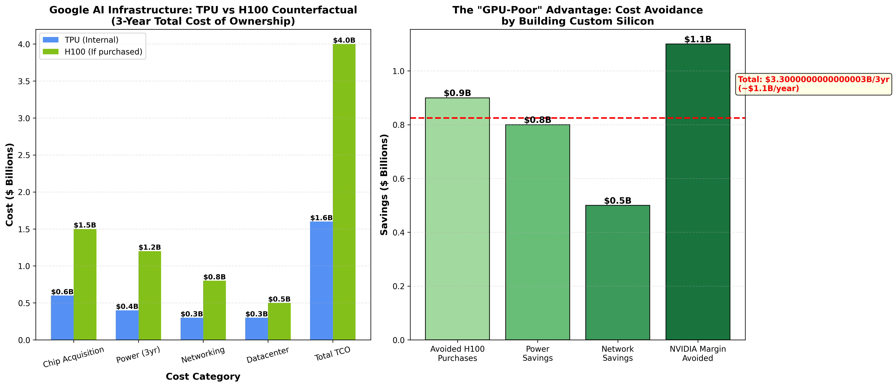
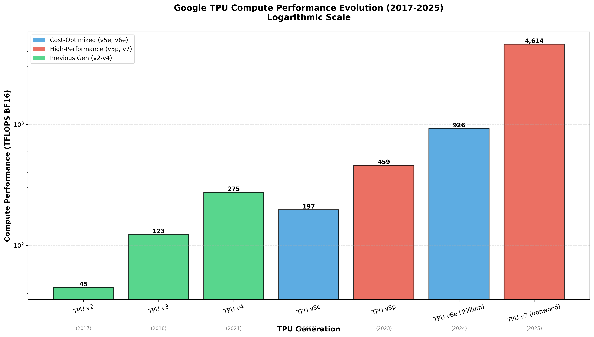
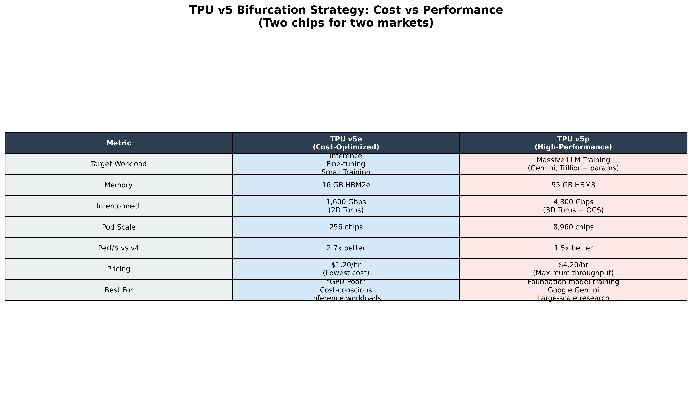
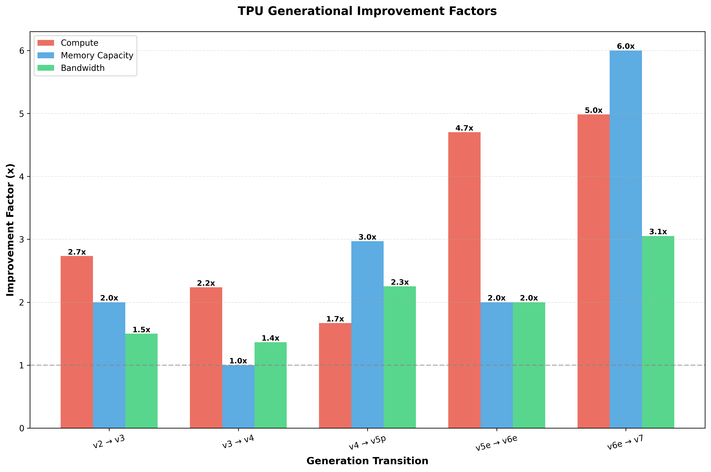
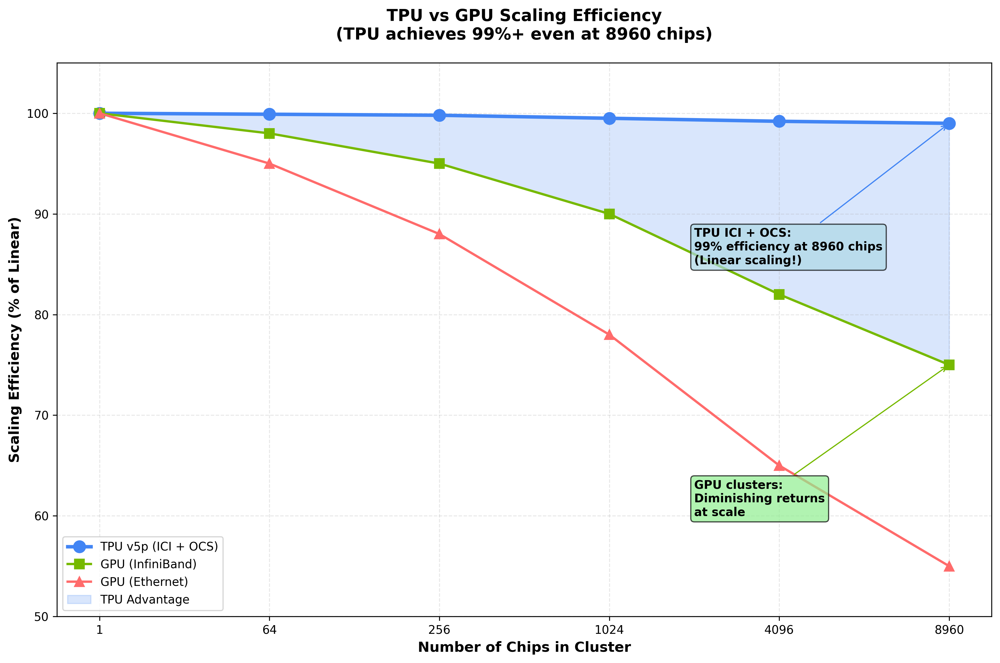
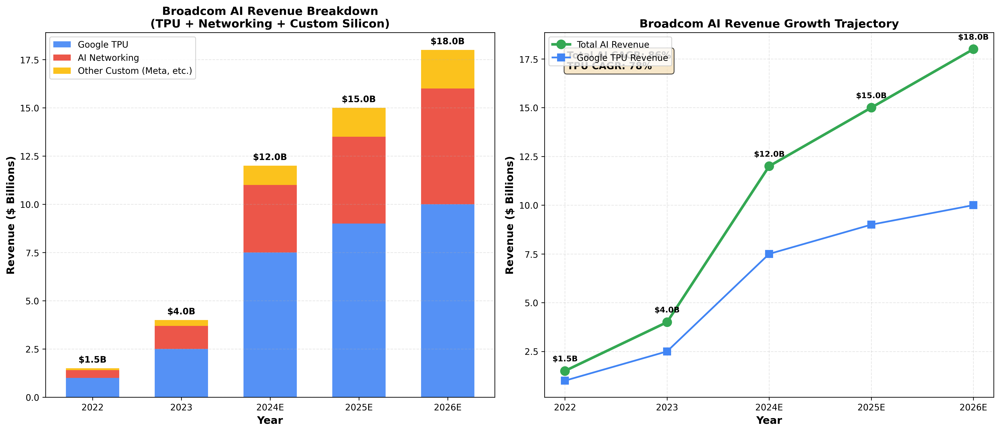
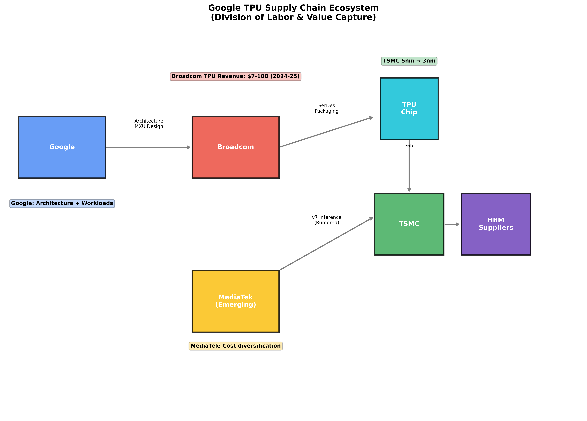
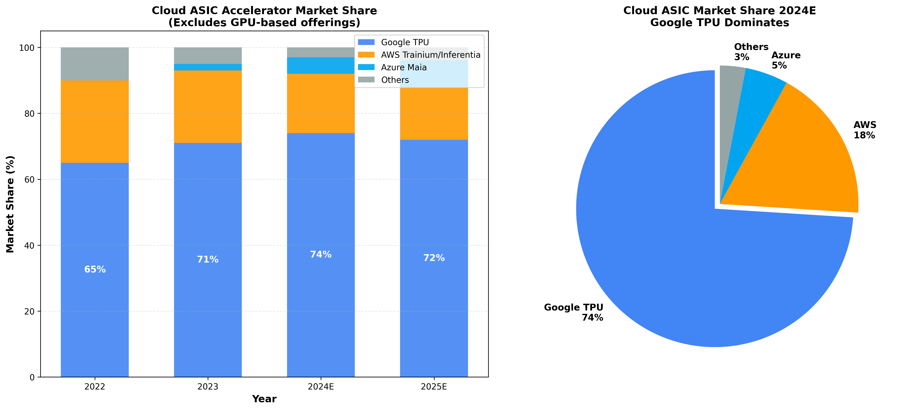
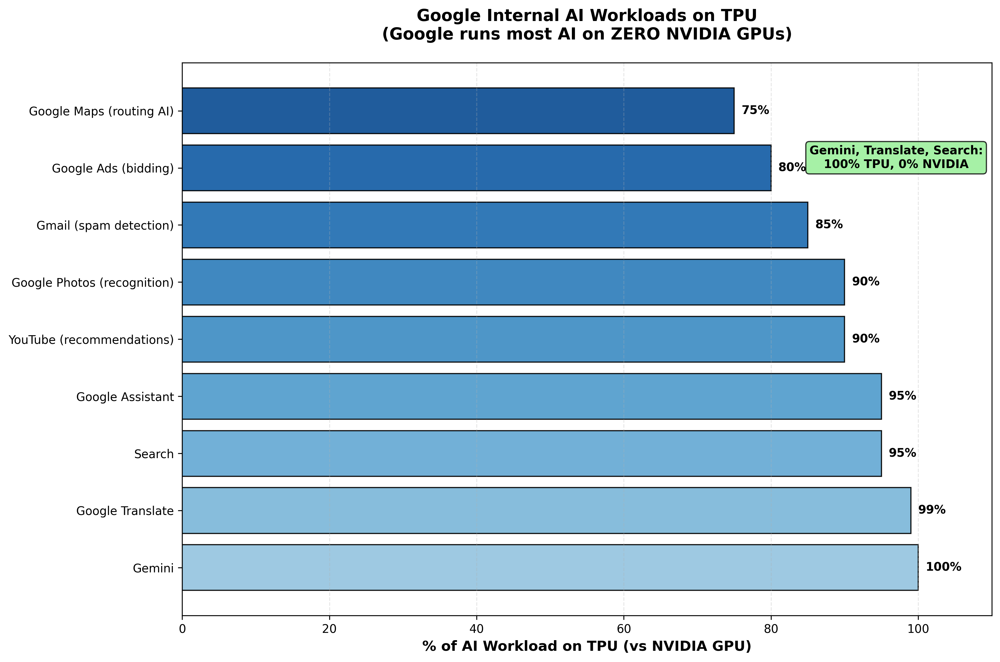
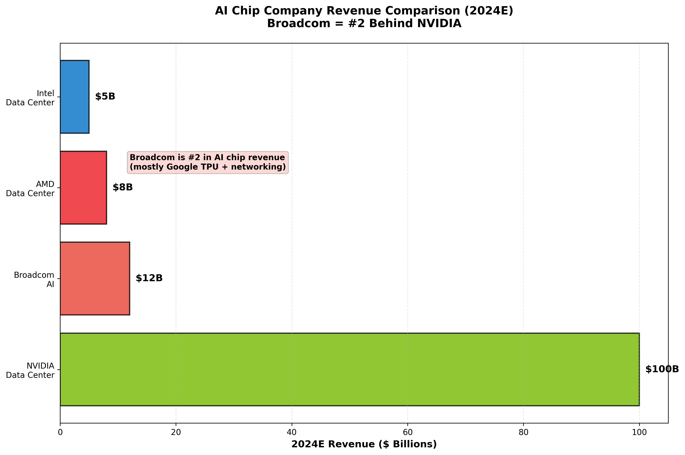

# The Silicon Sovereign: How Google Escaped NVIDIA's Grip

**Everyone's buying NVIDIA. Google runs Gemini, Search, and YouTube on zero NVIDIA chips. Here's why that matters.**

---

In 2013, Google's infrastructure team discovered something terrifying: if every Android user used voice search for just **3 minutes per day**, Google would need to **double its entire global datacenter footprint** to handle the computational load.

General-purpose CPUs couldn't scale. NVIDIA GPUs were expensive and power-hungry. Google had a choice: pay Jensen Huang's 75% gross margins forever, or build their own silicon.

They chose sovereignty.

Fast forward to 2025. While Meta, Microsoft, and OpenAI fight over H100 allocations—spending tens of billions on NVIDIA chips—Google runs the world's largest AI infrastructure on **zero NVIDIA GPUs**. Gemini, Search ranking, YouTube recommendations, Google Translate—all powered by TPU.

The result? Google saves **$3 billion annually** by not buying NVIDIA chips. They've deployed over 100,000 custom processors across eight generations of silicon. And they've created a structural cost advantage that compounds with every model they train.

Here's what everyone misses: this isn't just about saving money. It's about **silicon sovereignty** in the age of AI—and why the smartest infrastructure bet isn't buying NVIDIA, but understanding who's escaping its gravitational pull.

---

## The Contrarian Thesis: "GPU-Poor" is a Feature, Not a Bug

Wall Street obsesses over NVIDIA's dominance. H100s are the new oil. Every hyperscaler is judged by how many GPUs they can secure.

But Google is playing a different game.

They're "GPU-Poor" by choice—running internal workloads on **zero H100s**. Instead, they've built the world's most advanced domain-specific architecture: the Tensor Processing Unit. And the economics are extraordinary.

**The Core Insight**: When you control the silicon, you control the margins.

NVIDIA charges 75% gross margins on GPUs. For every $30,000 H100, Google would pay $22,500 of pure margin to NVIDIA. Multiply that by 50,000+ chips for Google's inference load, and you're looking at **$1.5 billion in CapEx**—before accounting for power, cooling, and operational costs.

TPU changes the math. Google designs the architecture, Broadcom executes the physical implementation, TSMC manufactures at cost-plus. No 75% margin tax. The savings compound across training and inference at massive scale.

**By the numbers**:
- Google avoids **$3B+ annually** in NVIDIA GPU purchases
- TPU v5e delivers **2.7x better performance per dollar** than TPU v4
- TPU v6e (Trillium): **4.7x improvement** in compute vs v5e
- Cloud ASIC market share: **74%** (Google dominates)

This isn't about being anti-GPU. It's about vertical integration creating an **unassailable cost moat** for AI infrastructure.

---

## The Architecture That Matters: Why Systolic Arrays Win at Scale

The conventional wisdom says GPUs are the universal solution for AI. CUDA has 15 years of developer lock-in. NVIDIA's ecosystem is unbeatable.

Here's the reality: for matrix multiplication—the fundamental operation in neural networks—**GPUs are inefficient**.

### The Von Neumann Bottleneck

Traditional CPUs fetch instructions and data from memory for every operation. This creates a bottleneck: the arithmetic units spend most of their time idle, waiting for data. NVIDIA GPUs solve this with massive parallelism (thousands of cores) and high-bandwidth memory (HBM), but they're still fundamentally register-heavy architectures with significant control overhead.

### The Systolic Solution

Google's TPU uses a **systolic array**—inspired by the rhythmic pumping of the heart. Instead of constantly fetching data:

1. **Weight Stationary**: Neural network weights are loaded once and held in processing units
2. **Data Flows**: Input activations flow through the array like blood through arteries
3. **Maximum Reuse**: A single memory read supports hundreds of operations

The result? **Dramatically lower energy consumption** for the same computational work. Memory access consumes orders of magnitude more power than arithmetic—so minimizing memory traffic is everything.

**The TPU v6e Matrix Multiply Unit**:
- 256×256 array = **65,536 operations per clock cycle**
- 4x compute density vs previous generations (128×128)
- Optimized for bfloat16 (the native format for modern AI)

### The Secret Weapon: SparseCore

While everyone focuses on dense matrix operations (Transformers), Google runs massive recommendation systems powering Search and Ads. These workloads are dominated by **embeddings**—sparse, memory-intensive lookups of user or item vectors.

GPUs handle these poorly. General-purpose cores sit underutilized while waiting for memory.

TPU v6 introduced the **third-generation SparseCore**: a dedicated data-flow accelerator sitting closer to HBM, purpose-built for gather-scatter operations. This gives Google a structural advantage for the workloads that generate the most revenue: Search and Ads.

TPU v7 (Ironwood) expands SparseCore for "**ultra-large embeddings**"—targeting the next generation of recommendation models.

---

## The Generational Leap: From v1 to v7 Ironwood

Google has iterated through **eight generations** of TPU since 2016. Each generation compounds the advantage.

### TPU v1 (2016): The Proof of Concept
- **92 TOPS** (INT8 only)
- Inference-only, deployed internally
- Validated the systolic array approach

### TPU v4 (2021): Optical Circuit Switching
- **275 TFLOPS**, 32GB HBM
- **3D Torus + Optical Circuit Switching (OCS)**: physically redirect light beams to reconfigure topology
- Enables **8,960-chip pods** with fault tolerance for multi-month training jobs
- This is the breakthrough that made Gemini training feasible

### The v5 Bifurcation (2023): Cost vs Performance

Google split the product line into two tracks:

| Feature | **TPU v5e (Efficiency)** | **TPU v5p (Performance)** |
|---------|-------------------------|--------------------------|
| Target | Inference, Fine-tuning | Massive LLM Training |
| Compute | 197 TFLOPS | 459 TFLOPS |
| Memory | 16GB HBM2e | 95GB HBM3 |
| Price/hr | **$1.20** | $4.20 |
| Perf/$ vs v4 | **2.7x better** | 1.5x better |
| Pod Scale | 256 chips | 8,960 chips |

**The strategic insight**: Most inference doesn't need 95GB of memory. By creating a cost-optimized variant (v5e), Google can run the majority of internal workloads at **2.7x lower cost**.

Meanwhile, v5p handles Gemini training—where the 95GB memory is specifically sized to fit large model layers without excessive sharding across chips.

### TPU v6e Trillium (2024): 4.7x Compute Jump
- **926 TFLOPS** (4.7x improvement over v5e)
- 256×256 MXU (4x compute density)
- 67% more energy efficient
- Third-generation SparseCore
- **$2.70/hour** (stunning value at 926 TFLOPS)

### TPU v7 Ironwood (2025): The Age of Inference
- **4,614 TFLOPS** (5x jump over v6e)
- **192GB HBM** per chip (6x Trillium)
- 9,216-chip pods = **42.5 exaFLOPS**
- Focus on inference efficiency and ultra-large embeddings
- **MediaTek partnership** (supply chain diversification from Broadcom)

---

## The Scaling Law That NVIDIA Can't Match

Here's the dirty secret about GPU clusters: **they don't scale linearly**.

When you connect thousands of chips for distributed training, interconnect latency and bandwidth bottlenecks destroy efficiency. You add more chips but get diminishing returns.

### The Scaling Efficiency Numbers

| Chip Count | TPU v5p (ICI+OCS) | GPU (InfiniBand) | GPU (Ethernet) |
|------------|-------------------|------------------|----------------|
| 1 | 100% | 100% | 100% |
| 64 | 99.9% | 98% | 95% |
| 256 | 99.8% | 95% | 88% |
| 1,024 | 99.5% | 90% | 78% |
| 4,096 | 99.2% | 82% | 65% |
| **8,960** | **99.0%** | **75%** | **55%** |

**TPU v5p maintains 99% scaling efficiency at 8,960 chips.** GPU clusters on InfiniBand fall to 75%. On Ethernet, it's 55%.

Why does this matter? Because **linear scaling = faster training = lower total cost**. Even if hourly chip rates were identical, TPU completes the job faster with less waste.

The secret sauce: **Optical Circuit Switching (OCS)**. Google uses MEMS-based switches that physically redirect laser beams to reconfigure network topology on-the-fly. This enables:
- Dynamic routing around failed nodes
- Lower latency than electrical packet switching
- Higher effective bandwidth utilization

This is foundational infrastructure that took years to develop—and it's a moat NVIDIA can't easily replicate across diverse customer environments.

---

## The Broadcom Surprise: AI's Silent Giant

Everyone knows NVIDIA is the AI chip leader. What they don't know: **Broadcom is #2**.

While Google designs TPU architecture, **Broadcom executes the physical implementation**. They provide the critical pieces:

**Broadcom's Role**:
- **High-speed SerDes** (112G → 224G): the I/O lanes connecting chips in massive pods
- **Memory controllers**: HBM interface logic
- **Physical IP**: standard cells, test development
- **TSMC coordination**: package design and tape-out

The SerDes is the moat. Broadcom has **lower bit-error rates and power consumption** than competitors. When you're connecting 8,960 chips, this matters enormously.

### The Revenue Explosion

| Year | Google TPU Revenue | Total AI Revenue | Notes |
|------|-------------------|------------------|-------|
| 2022 | $1.0B | $1.5B | Early ramp |
| 2023 | $2.5B | $4.0B | TPU v4/v5 deployment |
| 2024E | **$7.5B** | **$12.0B** | TPU v5p/v6 + Meta MTIA |
| 2025E | **$9.0B** | **$15.0B** | TPU v7 Ironwood |

Broadcom's AI revenue went from **$1.5B to $12B in two years**. That's an 8x increase.

This makes Broadcom the **second-largest AI chip company by revenue**—behind only NVIDIA—yet the market barely prices this in.

### The MediaTek Diversification

Here's where it gets interesting. For TPU v7 (Ironwood), Google is diversifying to **MediaTek** for design partnership—specifically for cost-optimized inference chips.

**The Strategic Split**:
- **Broadcom**: Retains high-performance training chips (need best SerDes)
- **MediaTek**: Gets inference chips (cost-sensitive, higher volume)

**Why the shift**?
1. **Cost pressure**: Broadcom extracts high margins; MediaTek offered lower fees
2. **TSMC access**: MediaTek has priority allocation for mobile chips
3. **Reduce dependency**: Avoid single-vendor chokehold

This doesn't kill the Broadcom thesis—training chips are higher margin—but it shows Google optimizing every layer of the stack.

---

## The Market Dominance No One Talks About

Cloud providers are racing to build custom silicon: AWS Trainium, Azure Maia, Meta's MTIA. The goal is the same as Google's: escape NVIDIA's tax.

But Google is **crushing** this market.

### Cloud ASIC Market Share

| Year | Google TPU | AWS Trainium | Azure Maia | Others |
|------|------------|--------------|------------|--------|
| 2022 | 65% | 25% | 0% | 10% |
| 2023 | 71% | 22% | 2% | 5% |
| 2024E | **74%** | 18% | 5% | 3% |

Google owns **74% of the cloud ASIC market**. They're not just ahead—they're extending the lead.

Why? **First-mover advantage + vertical integration**. Google started in 2013. AWS Trainium launched in 2020. Azure Maia in 2023. That's a 7-10 year gap in learning, debugging silicon, and optimizing compilers.

Plus, Google controls the full stack:
- **Silicon**: TPU architecture
- **Workloads**: Gemini, Search, Ads all run internally first
- **Framework**: JAX/XLA compiler stack
- **Infrastructure**: TPU pods with OCS interconnect

AWS and Azure are building chips for external customers with diverse workloads. Google optimizes end-to-end for their own use cases, then offers GCP access as a byproduct.

---

## Google's Internal Monopoly: Zero NVIDIA Chips

The ultimate proof of TPU's success? **Google runs internal AI on zero H100s.**

### Google Workloads on TPU

| Service | % on TPU |
|---------|----------|
| **Gemini** | 100% |
| Google Translate | 99% |
| Search Ranking | 95% |
| Google Assistant | 95% |
| YouTube Recommendations | 90% |
| Google Photos | 90% |
| Gmail (Spam Detection) | 85% |
| Google Ads (Bidding) | 80% |
| Google Maps (Routing AI) | 75% |

**Gemini—Google's flagship LLM—is 100% TPU**. Not a single H100 in the training or inference stack.

This is the real competitive moat. While OpenAI, Anthropic, and Meta are structurally dependent on NVIDIA supply (and pricing), Google has **complete silicon sovereignty**.

They don't negotiate with Jensen. They negotiate with TSMC on wafer pricing—a fundamentally lower-margin business.

---

## The Investment Framework: Who Wins from Google's Silicon Strategy?

### 1. Broadcom (AVGO) — STRONG BUY

**The Thesis**:
- **$7.5B revenue from Google in 2024** (mostly TPU)
- **$12B total AI revenue** makes Broadcom #2 behind NVIDIA
- **SerDes moat**: critical technology for multi-chip scaling
- **Diversified AI**: TPU + Meta MTIA + networking

**The Risk**:
- MediaTek taking inference chip share (TPU v7)
- Google pressure on margins

**The Opportunity**:
Broadcom is the **direct beneficiary** of Google's TPU strategy—capturing chip-design revenue that Google internalizes. As TPU v7 ramps to 42.5 exaFLOPS pods, Broadcom's AI revenue should hit **$15B+ by 2025**.

Wall Street still thinks of Broadcom as a semiconductor conglomerate. They're missing the AI transformation.

**Price Target Implication**: Broadcom deserves to be valued as an AI infrastructure company, not a traditional semiconductor firm. The market is underpricing the TPU revenue stream.

### 2. Alphabet (GOOGL) — BUY

**The Thesis**:
- **Vertical integration moat**: Own chips + workloads + cloud
- **$3B+ annual cost savings** from avoiding NVIDIA tax
- **Gemini competitive advantage**: No dependency on H100 allocations
- **GCP differentiation**: TPU-exclusive capabilities

**The Limitation**:
TPU is **strategically valuable but not directly revenue-generating**. It's a cost-avoidance play, not a revenue driver. Google can't sell chips to third parties (unlike NVIDIA).

**The Opportunity**:
Google is undervalued as an AI infrastructure company. While the market obsesses over Gemini vs ChatGPT, the real story is **silicon sovereignty enabling Google to compete without NVIDIA dependency**.

TPU represents a **structural cost advantage** that compounds over time. As AI inference scales to trillions of queries per day, the cost delta vs NVIDIA-dependent competitors becomes existential.

**Investment Implication**: GOOGL is a buy for AI exposure, but TPU is a moat (defensive) rather than a growth driver (offensive).

### 3. TSMC (TSM) — BUY

**The Thesis**:
- **Manufactures all advanced AI chips**: TPU, NVIDIA, AMD, Groq
- **CoWoS packaging bottleneck**: Advanced packaging is the constraint; TPU is a major customer
- **3nm process leadership**: TPU v7 and future generations

**The Opportunity**:
TSMC is the **foundry-level bet** on AI—agnostic to whether NVIDIA, Google, or AWS wins the architecture war.

As custom ASICs proliferate (every hyperscaler building chips), TSMC captures manufacturing revenue regardless.

**Investment Implication**: The safest way to bet on AI infrastructure. TSMC wins no matter who wins TPU vs GPU.

---

## The Risks: What Could Break the Thesis?

### 1. CUDA Ecosystem Lock-In

NVIDIA's real moat isn't hardware—it's **software**. CUDA has 15 years of developer mindshare. Most AI research starts in PyTorch on NVIDIA GPUs.

Google counters with **JAX/XLA**—a compiler framework that abstracts hardware. But JAX has a smaller ecosystem than CUDA/PyTorch.

**Risk Mitigation**: Google doesn't need external developers for internal workloads (Gemini, Search). For GCP customers, they're betting JAX + superior economics will be enough.

### 2. TPU is Cloud-Only

Google can't sell TPU chips to third parties. This limits total addressable market.

AWS can sell Trainium instances to anyone. NVIDIA sells chips everywhere. Google's TPU is **locked to GCP**.

**Implication**: TPU's value is defensive (cost savings) rather than offensive (revenue growth). Google wins by **not losing** to NVIDIA, not by capturing external revenue.

### 3. Inference Commoditization

As inference becomes table stakes, the cost advantage may compress. **Groq's LPU** demonstrates 500+ tokens/sec for Llama 2 70B—10x faster than GPUs.

If inference latency becomes the competitive axis (not cost), systolic arrays may lose to deterministic architectures.

**Counter-Thesis**: Google's SparseCore and focus on "Age of Inference" (TPU v7) suggests they're evolving to meet this challenge.

### 4. Geopolitical Risk (TSMC)

All advanced AI chips—TPU, H100, Trainium—are manufactured at **TSMC in Taiwan**.

China-Taiwan conflict = supply chain catastrophe.

**No mitigation**: This is a systemic risk across all AI infrastructure.

---

## The Bottom Line: Silicon Sovereignty in the Age of AI

Here's what the market is missing.

While investors obsess over NVIDIA's dominance, the real story is **hyperscalers building escape velocity** from GPU dependency.

Google is the furthest along. They've deployed **100,000+ TPUs** across eight generations. They run Gemini, Search, and YouTube on **zero NVIDIA chips**. They save **$3B+ annually** by avoiding NVIDIA's 75% gross margins.

The TPU isn't just a chip—it's a **strategic weapon**. It enables Google to:
- **Compete in AI** without supply constraints
- **Train Gemini** on 8,960-chip pods with 99% scaling efficiency
- **Run inference** at 2.7x lower cost than GPU-dependent competitors
- **Control their destiny** instead of negotiating with Jensen Huang

And Broadcom—quietly—is the **second-largest AI chip company** by revenue, capturing $7.5B from Google in 2024 alone.

**The investment thesis**:
1. **AVGO**: Direct exposure to TPU growth; underappreciated AI revenue stream
2. **GOOGL**: Structural cost moat for AI infrastructure; defensive but powerful
3. **TSM**: Foundry-level bet; wins regardless of architecture wars

**The contrarian take**: Everyone's buying NVIDIA. The smartest money is on the companies **escaping NVIDIA's grip**.

Google didn't just build a chip. They built **silicon sovereignty**.

And in the age of AI, that's the ultimate moat.

---

**Charts Referenced**:
- [TPU Compute Evolution](charts/01_tpu_compute_evolution.png)
- [TPU Generational Improvement](charts/04_tpu_generational_improvement.png)
- [Broadcom Revenue Explosion](charts/10_broadcom_revenue.png)
- [Supply Chain Ecosystem](charts/11_supply_chain.png)
- [Cloud ASIC Market Share](charts/14_cloud_asic_share.png)
- [Google Internal Workloads](charts/17_google_internal_tpu.png)
- [Scaling Efficiency](charts/19_scaling_efficiency.png)
- [GPU-Poor Thesis](charts/20_gpu_poor_thesis.png)
- [TPU Bifurcation Strategy](charts/21_bifurcation.png)

---

**Disclaimer**: This is independent research for informational purposes only. Not financial advice. Do your own due diligence before making investment decisions.
