# HBM (High-Bandwidth Memory) Deep Dive: The AI Memory Gold Rush

## Executive Summary

High-Bandwidth Memory (HBM) has transformed from a niche technology into the lifeblood of the AI revolution. This deep dive analyzes the explosive HBM market through hard data, supplier dynamics, and manufacturing economics to uncover where the real money is being made—and where it's going.

**Key Investment Thesis Points:**

1. **Explosive Growth**: HBM market expanding from $4B (2023) to $91B (2030) - a **23x expansion** with 56% CAGR
2. **Oligopoly Dynamics**: Only 3 suppliers (SK hynix, Samsung, Micron) control 100% of supply, creating pricing power
3. **Margin Expansion**: HBM gross margins (35-40%) significantly exceed standard DRAM (25%), with 9x ASP premium per GB
4. **Supply Constraints**: Industry running at 110-118% utilization through 2025, creating seller's market
5. **Winner's Curse**: SK hynix dominates with 50%+ share due to superior yields (75-80% vs Samsung's 50-55%), but Samsung and Micron are catching up fast

**The Contrarian Take**: While everyone chases AI chip makers, the real choke point—and thus pricing power—sits with memory suppliers. HBM is the oil pipeline of AI, and there are only three companies that can build it at scale.

---

## Market Overview: From Niche to Necessity

### What is HBM?

HBM is a 3D-stacked DRAM technology that vertically stacks multiple memory dies (8-16 layers) on a base logic die, interconnected by thousands of microscopic Through-Silicon Vias (TSVs). This architecture delivers:

- **Massive bandwidth**: 1.2-2.0 TB/s per stack (vs 64 GB/s for DDR5)
- **High density**: 24-64 GB per stack in a tiny footprint
- **Power efficiency**: ~30% lower power per GB than previous generations

Every leading AI accelerator—NVIDIA H100/H200, AMD MI300, Google TPU—depends on HBM. There is no substitute. Standard GDDR or DDR cannot deliver the bandwidth needed for trillion-parameter models and high-throughput inference.

### Market Size and Growth

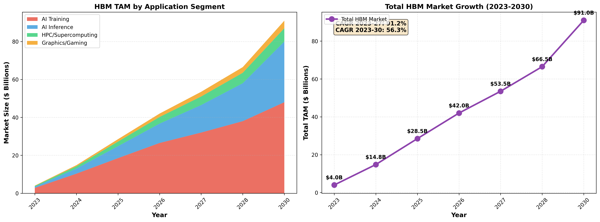

**2023**: $4.0B total market
- AI Training: $2.8B (70%)
- AI Inference: $0.6B (15%)
- HPC/Supercomputing: $0.4B (10%)
- Graphics/Gaming: $0.2B (5%)

**2027**: $53.5B projected (+13.4x from 2023)
- AI Training: $32.0B
- AI Inference: $14.5B
- HPC: $4.5B
- Graphics: $2.5B

**2030**: $91.0B projected (+23x from 2023)
- **CAGR 2023-2030**: 56%
- **CAGR 2023-2027**: 86%

**Growth Drivers**:
1. AI accelerator shipments: 1.5M units (2023) → 18M units (2030)
2. HBM content per GPU: 80GB (2023) → 512GB (2030)
3. Expanding use cases: training → inference → edge AI → autonomous vehicles

The market is transitioning from AI training dominance to a more balanced mix, with inference growing 53x from 2023 to 2030 as deployed AI applications scale.

---

## Supplier Landscape: The Three Horsemen

### Market Share Evolution

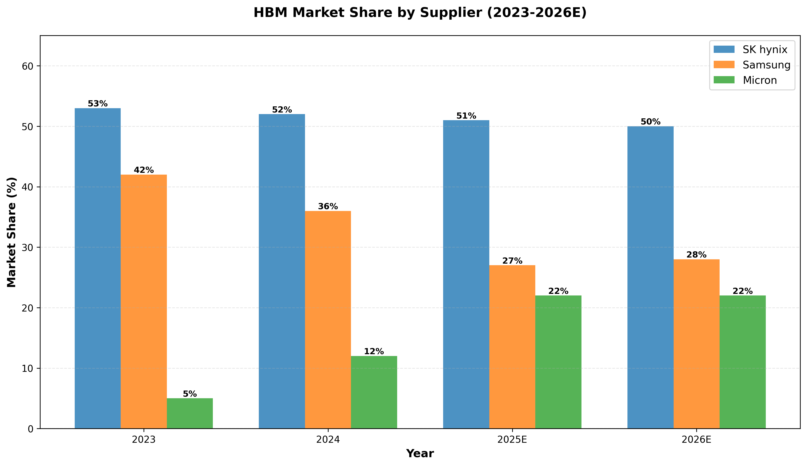

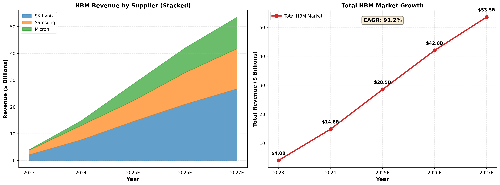

| Supplier | 2023 Share | 2025E Share | Key Strength | Key Weakness |
|----------|------------|-------------|--------------|--------------|
| **SK hynix** | 53% | 51% | First-mover, 80% yields, NVIDIA lock-in | Less aggressive on HBM4 timeline |
| **Samsung** | 42% | 27% | Massive scale, custom solutions | Poor yields (50-55%), late to HBM3E |
| **Micron** | 5% | 22% | Leapfrog strategy, power efficiency | Late entrant, capacity constrained |

**Key Observations**:
- **SK hynix** maintains dominance through execution excellence and NVIDIA partnership
- **Samsung** losing share despite massive investments due to yield problems
- **Micron** making dramatic share gains by skipping HBM3 and going straight to HBM3E with superior power characteristics

**Revenue Projections**:
- **2024**: $14.8B total (SK hynix $7.7B, Samsung $5.3B, Micron $1.8B)
- **2027**: $53.5B total (SK hynix $26.8B, Samsung $15.0B, Micron $11.8B)

**Market Concentration**: This is an effective oligopoly. No other suppliers can enter due to massive R&D requirements, TSV patents, and multi-year qualification cycles with customers.

---

## Technology Roadmap: HBM3 → HBM3E → HBM4

### Bandwidth and Performance Evolution

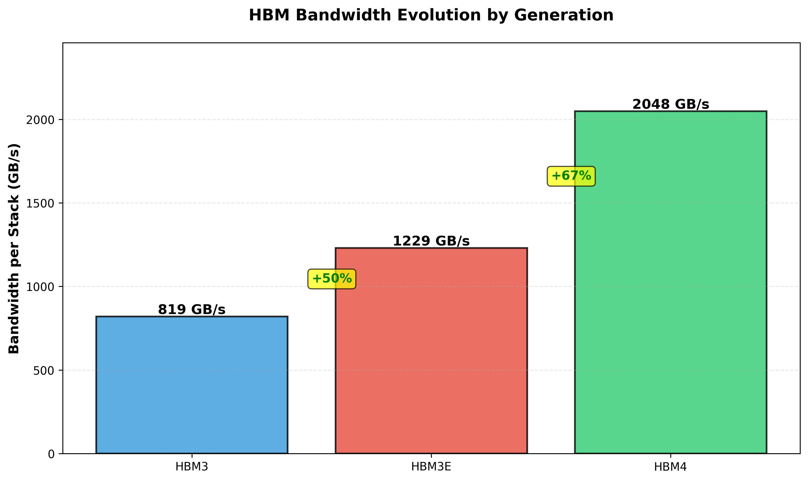

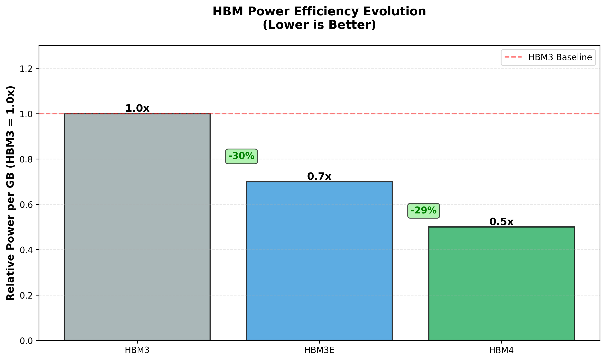

| Generation | Bandwidth/Stack | Pin Speed | Interface Width | Max Capacity | Power vs HBM3 | Status |
|------------|----------------|-----------|-----------------|--------------|---------------|--------|
| **HBM3** | 819 GB/s | 6.4 Gbps | 1024-bit | 24GB (8-Hi) | 1.0x baseline | Mature (2022) |
| **HBM3E** | 1,229 GB/s | 9.6 Gbps | 1024-bit | 36GB (12-Hi) | 0.7x (-30%) | Ramping (2024) |
| **HBM4** | 2,048 GB/s | 8.0 Gbps | 2048-bit | 64GB (16-Hi) | 0.5x (-50%) | Sampling (2025) |

**Key Improvements**:
- **HBM3E**: +50% bandwidth, +50% capacity (12-Hi), -30% power
- **HBM4**: +67% bandwidth, +78% capacity (16-Hi), -50% power, 2x interface width

### Supplier Technology Roadmap

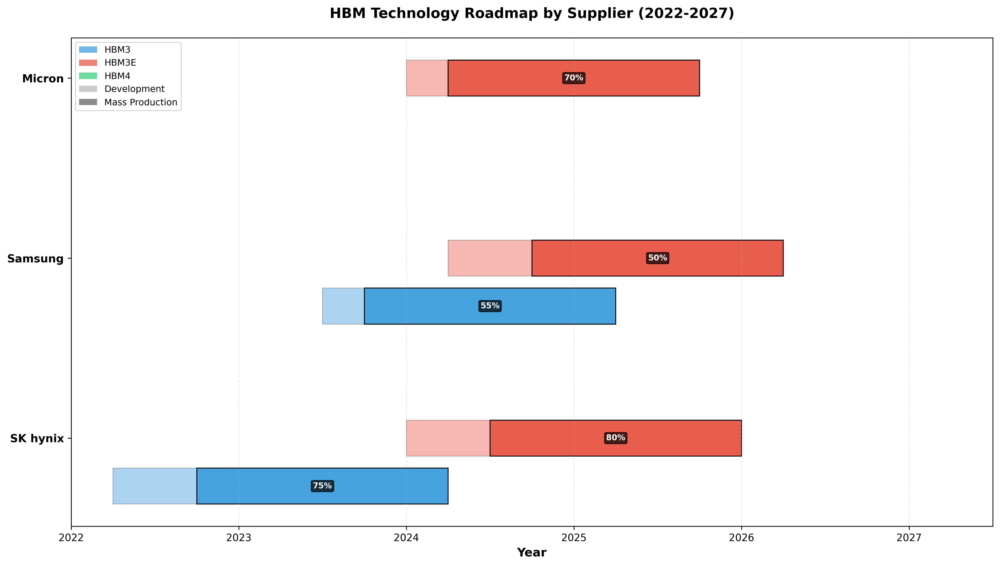

**SK hynix** (Market Leader):
- **HBM3**: First to market (Q2 2022), mass production Q4 2022, 75% yield
- **HBM3E**: Mass production Q3 2024, industry-leading 80% yield on 8-Hi, 75% on 12-Hi
- **HBM4**: Samples Q1 2025 (first in industry), mass production Q3 2026, targeting 70% yield
- **Secret sauce**: Proprietary MR-MUF (Mass Reflow Molded Underfill) packaging process allows batch stacking vs competitor's per-layer TCB bonding

**Samsung** (Scale Player):
- **HBM3**: Late entry (Q3 2023), qualified with NVIDIA Q4 2023, only 55% yield
- **HBM3E**: Started Q2 2024, finally qualified with NVIDIA Q3 2024 after initial failures, 50% yield on 8-Hi, 45% on 12-Hi
- **HBM4**: Aggressive timeline targeting Q4 2025 mass production (ahead of rivals), 60% yield target
- **Challenge**: Yield problems persist despite massive investments; still using TCB+NCF process

**Micron** (Fast Follower):
- **HBM3**: **Skipped entirely** - strategic leapfrog decision
- **HBM3E**: First to ship commercially (Q1 2024), qualified on NVIDIA H200, 70% yield on 8-Hi, 65% on 12-Hi
- **HBM4**: Samples Q1 2025, mass production Q1 2026, 65% yield target
- **Advantage**: Superior power efficiency (30% lower than competitors), 12-Hi focus, strong TSMC partnership

**Critical Insight**: This is a **process execution game**, not just a capital game. Samsung has nearly unlimited capital but trails on yields. SK hynix wins through proprietary packaging innovation (MR-MUF) that enables higher throughput and better thermals.

---

## Manufacturing Economics: Why HBM Prints Money

### Yield Comparison

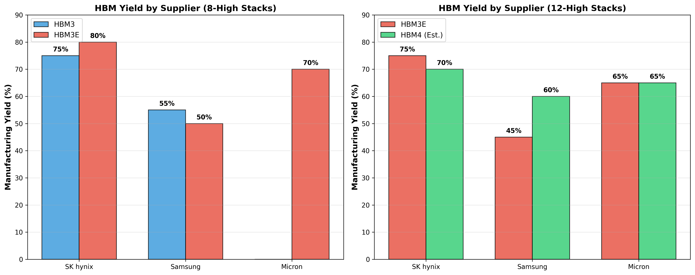

**Yield Reality**:
- **8-High HBM3E**: SK hynix 80%, Micron 70%, Samsung 50%
- **12-High HBM3E**: SK hynix 75%, Micron 65%, Samsung 45%

**Why Yields Matter**:
- Each percentage point of yield = direct margin impact
- 12-High stacking compounds defects: even 99% per-layer yield → 88% stack yield
- Samsung's 50% yield means **half of manufactured stacks are scrapped**
- This is why Samsung loses share despite spending more than SK hynix

**Yield Drivers**:
1. **TSV process control**: Etching thousands of holes without defects
2. **Die stacking precision**: Sub-micron alignment across 12 layers
3. **Thermal management**: Preventing warpage during assembly
4. **Power delivery network**: Robust TSV distribution (SK hynix uses 6x more power TSVs)

### Cost Structure

**Cost Breakdown (HBM3E 8-High stack)**:
- Wafer cost: 59% ($600)
- TSV process: 15% ($150)
- Packaging: 18% ($180)
- Testing: 8% ($90)
- **Total**: ~$1,020 per stack

**Cost Evolution**:
- HBM3 8-Hi: $850 per stack (Index: 100)
- HBM3E 8-Hi: $1,020 (Index: 120)
- HBM3E 12-Hi: $1,560 (Index: 183)
- HBM4 12-Hi: $1,908 (Index: 224)

**Key Insights**:
- HBM uses **3x more wafer capacity** than standard DRAM for same bit output (due to TSV keep-out zones)
- Packaging cost scales non-linearly with stack height (12-Hi packaging is 2x not 1.5x of 8-Hi)
- Testing is complex: each stack has 1000+ I/O connections to verify

### Margin Structure

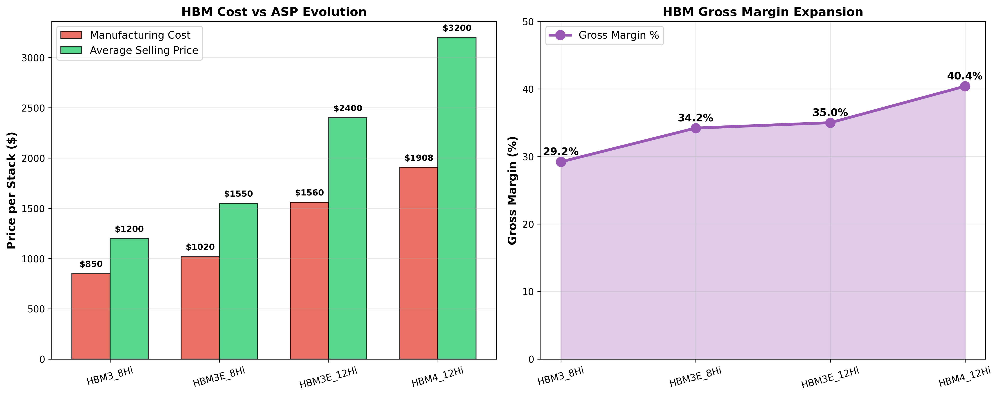

**Economics by Generation**:

| Product | Cost/Stack | ASP/Stack | Gross Margin | ASP per GB |
|---------|-----------|-----------|--------------|------------|
| HBM3 8-Hi (24GB) | $850 | $1,200 | 29.2% | $50 |
| HBM3E 8-Hi (24GB) | $1,020 | $1,550 | 34.2% | $65 |
| HBM3E 12-Hi (36GB) | $1,560 | $2,400 | 35.0% | $67 |
| HBM4 12-Hi (48GB) | $1,908 | $3,200 | 40.4% | $67 |

**Margin Expansion Drivers**:
1. Supply constraints → pricing power (market running 110%+ utilization through 2025)
2. Higher ASPs per GB as generational transitions occur
3. Learning curve improvements driving cost down faster than ASP
4. Premium for advanced nodes (HBM4 carries 40%+ gross margin)

### HBM vs Standard DRAM Economics

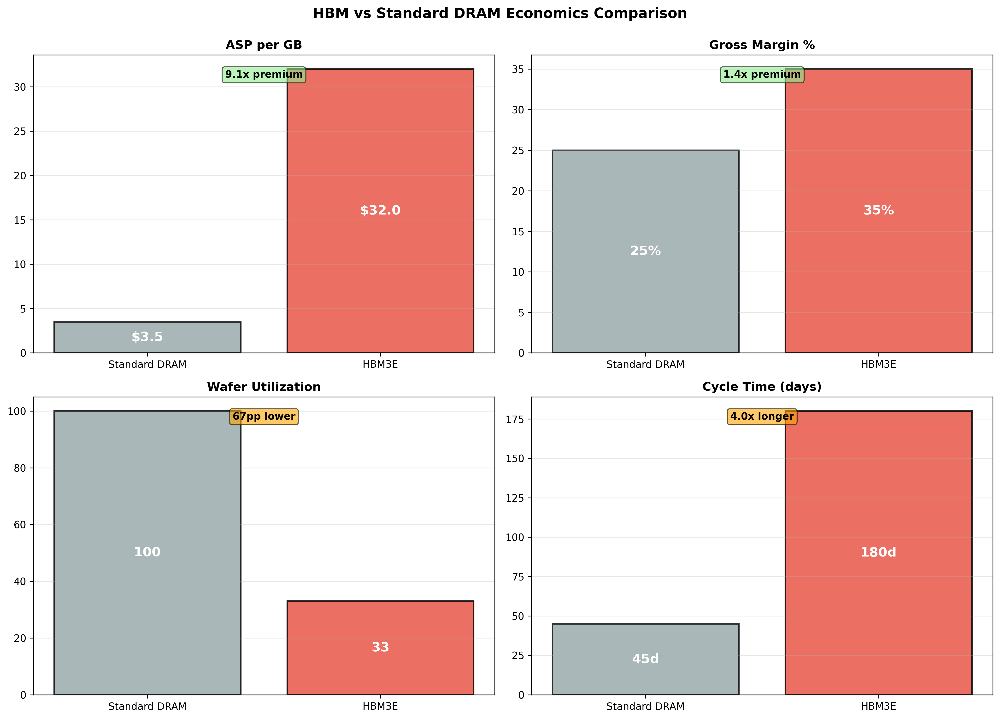

**The Money Gap**:

| Metric | Standard DRAM | HBM3E | HBM Premium |
|--------|---------------|-------|-------------|
| **ASP per GB** | $3.50 | $32 | **9.1x** |
| **Gross Margin** | 25% | 35% | **+10 percentage points** |
| **Wafer Utilization** | 100% | 33% | **-67%** (HBM uses 3x wafer area) |
| **Cycle Time** | 45 days | 180 days | **4x longer** |

**The Trade-Off**:
- HBM sacrifices bit volume (uses 3x wafer capacity) but captures 9x ASP premium
- Net result: **Higher revenue per wafer, better margins, but constrained supply**
- This is why DRAM makers are converting capacity to HBM despite lower bit output

**Economic Reality**:
- Converting 10% of DRAM fab to HBM might reduce bit output by 30% but increase revenue by 40%+
- The constraint is packaging capacity (TSV tools, CoWoS interposers), not front-end DRAM capacity

---

## Supply-Demand Dynamics: The Bottleneck

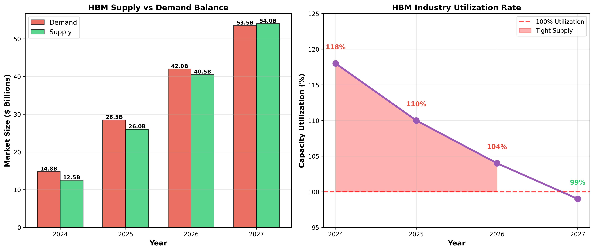

**Capacity Utilization**:
- **2024**: 118% (demand $14.8B vs supply $12.5B) - severe shortage
- **2025**: 110% (demand $28.5B vs supply $26.0B) - tight supply
- **2026**: 104% (demand $42.0B vs supply $40.5B) - approaching balance
- **2027**: 99% (demand $53.5B vs supply $54.0B) - balanced

**Supply Constraints**:

1. **TSV Tool Capacity**: Limited suppliers (TEL, AMAT) of TSV etch/plating equipment
2. **CoWoS Packaging**: TSMC's advanced packaging for HBM integration is bottlenecked
3. **Yield Ramps**: Samsung's 50% yields create artificial scarcity
4. **Long Cycle Times**: 6+ months from wafer start to finished module

**Capital Expenditures** (HBM-related):
- **SK hynix**: $5.3B invested in HBM capacity (2024), building dedicated M16 fab
- **Samsung**: $6.8B for HBM/advanced DRAM, expanding Pyeongtaek P5 line
- **Micron**: $2.1B HBM-related capex, partnering with TSMC for packaging

**Timeline to Relief**:
- New capacity comes online 2025-2026 (18-24 month lead time from investment to production)
- Industry expects supply-demand balance by late 2026
- **But**: HBM4 transition in 2026 will create new bottlenecks (new packaging, lower initial yields)

**Investment Implication**: Tight supply through 2025 means pricing power remains with suppliers. Any yield improvements by Samsung or capacity adds by Micron will be immediately absorbed by demand.

---

## Unit Economics: Following the Money

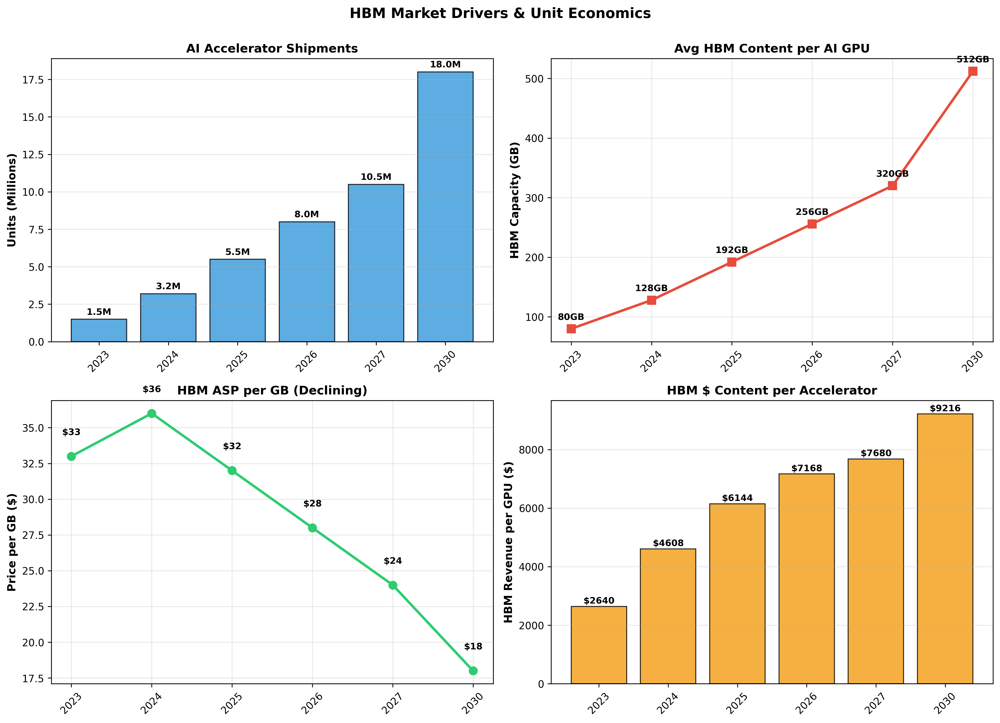

### AI Accelerator Build-up

**NVIDIA H200 (80GB HBM3E) Example**:
- 5× HBM3E 12-Hi stacks (36GB each) + 2× 8-Hi stacks (24GB each) = 228GB total
- HBM cost: ~$8,800 per GPU (at $1,550 per 8-Hi stack equivalent)
- GPU die cost: ~$2,500
- Packaging (CoWoS): ~$800
- Other components: ~$400
- **Total BOM**: ~$12,500
- **Selling price**: ~$30,000-40,000
- **HBM represents 70% of silicon cost, 22-29% of total GPU price**

### Content Inflation Trajectory

| Year | Avg HBM/GPU | AI Accelerators Shipped | Total HBM Demand |
|------|-------------|------------------------|------------------|
| 2023 | 80 GB | 1.5M units | 120M GB |
| 2024 | 128 GB | 3.2M | 410M GB |
| 2025 | 192 GB | 5.5M | 1,056M GB |
| 2026 | 256 GB | 8.0M | 2,048M GB |
| 2030 | 512 GB | 18.0M | 9,216M GB |

**Content Drivers**:
- Larger language models (GPT-4 → GPT-5 → multimodal trillion-parameter models)
- Longer context windows (8K → 128K → 1M tokens)
- Higher-resolution inference (text → image → video generation)
- Edge AI deployment (autonomous vehicles with 1TB+ of HBM)

**ASP Evolution** (blended across all HBM):
- 2023: $33/GB
- 2024: $36/GB (peak shortage pricing)
- 2025: $32/GB (some relief)
- 2026: $28/GB (HBM4 mix)
- 2030: $18/GB (maturity + competition)

**Revenue Calculation** (2025 example):
- 1,056M GB demanded × $32/GB = **$33.8B theoretical TAM**
- Actual TAM: $28.5B (some discount for volume contracts)

---

## Investment Thesis: Where to Place Bets

### The Bull Case for HBM Suppliers

**Why This Is a Generational Opportunity**:

1. **Structural Demand**: AI is not a fad. LLMs, computer vision, and autonomous systems are multi-decade secular trends
2. **Oligopoly Pricing**: Only 3 suppliers, massive barriers to entry (YMTC tried and failed)
3. **Supply Discipline**: Suppliers learned from past DRAM gluts; HBM capacity is controlled and deliberate
4. **Margin Expansion**: 35-40% gross margins vs 25% standard DRAM, and expanding with HBM4
5. **Content Growth**: HBM per GPU doubling every 2-3 years, faster than unit growth

**Risks**:
- **Cyclicality**: DRAM is historically cyclical; could HBM oversupply crash prices by 2027-28?
- **Customer Concentration**: 70%+ of HBM goes to NVIDIA; if NVIDIA slows, entire HBM market contracts
- **Geopolitical**: Samsung/SK hynix are Korean; China-Taiwan tensions could disrupt supply chains
- **Technology Disruption**: New memory technologies (MRAM, ReRAM) could displace HBM in 2030s

### Supplier-Specific Takes

**SK hynix** - [Pick & Shovels Winner]
- **Pros**: Market leader, best yields, locked into NVIDIA ecosystem, HBM4 samples already out
- **Cons**: Fully priced in (trades at premium to sector), execution risk on HBM4 ramp
- **Verdict**: **HOLD/BUY** - The safe play. Execution excellence justifies premium valuation
- **Upside scenario**: Maintains 50%+ share through HBM4, gross margins expand to 42%+

**Samsung Electronics** - [Turnaround Play]
- **Pros**: Massive capex firepower, custom HBM for hyperscalers (Microsoft, Meta), aggressive HBM4 timeline
- **Cons**: Persistent yield problems, losing share, quality control issues
- **Verdict**: **WATCH** - High risk/reward. If Samsung fixes yields, stock could re-rate 30%+
- **Upside scenario**: Yields improve to 65%+ on HBM3E/4, recaptures 35% market share by 2027
- **Downside**: Yields stay stuck at 50%, share bleeds to 20%, becomes marginal player

**Micron Technology** - [Fast Follower with Asymmetric Upside]
- **Pros**: Sold out through 2025, superior power efficiency, 12-Hi focus, only non-Asian supplier (geopolitical hedge)
- **Cons**: Late entrant, capacity constrained vs peers, smaller HBM team
- **Verdict**: **BUY** - Best risk/reward. Going from 5% → 22% share in 2 years, yet trades in line with sector
- **Upside scenario**: Captures 25%+ share by 2027, expands capacity with US CHIPS Act subsidies, becomes NVIDIA's geopolitically-safe second source
- **Catalyst**: HBM4 volume ramp in 2026 with competitive yields (65%+)

### Derivative Plays

**Equipment Suppliers**:
- **Tokyo Electron (TEL)** / **Applied Materials (AMAT)**: TSV etch/deposition tools - bottleneck suppliers
- **ASML**: EUV lithography for 1γ/1δ nodes needed for HBM4/5
- **TSMC**: CoWoS packaging for HBM integration (though not a pure play)

**Materials**:
- **Namics**: MR-MUF underfill material (SK hynix exclusive partner)
- **Ajinomoto**: ABF substrate materials for packaging

---

## The Contrarian Angle: What the Market Misses

### Misconception #1: "HBM is just expensive DRAM"

**Reality**: HBM is fundamentally different - it's a **systems integration** business, not just memory. The value is in TSV process know-how, thermal design, and packaging. This creates moats.

Standard DRAM competes on cost/bit. HBM competes on **performance/watt and bandwidth**. Completely different game.

### Misconception #2: "NVIDIA has all the pricing power"

**Reality**: NVIDIA is capacity-constrained by HBM supply. SK hynix can (and does) dictate HBM pricing to NVIDIA. When NVIDIA's H200 was delayed, it was due to HBM shortages, not GPU die supply.

The **real bottleneck in AI infrastructure is HBM**, not compute. Memory suppliers have more pricing power than acknowledged.

### Misconception #3: "HBM will commoditize like DRAM"

**Reality**: Unlikely before 2028+ because:
1. Only 3 suppliers (vs 6+ in standard DRAM)
2. Multi-year qualification cycles create stickiness
3. Each generation (HBM4, HBM5) resets the game with new bottlenecks
4. Custom HBM solutions for hyperscalers (Microsoft, Meta) create differentiation

HBM is more like **foundry wafers** (oligopoly, sticky customers, technology transitions) than commodity DRAM.

### Misconception #4: "Samsung will inevitably win due to scale"

**Reality**: **Process execution beats capital** in HBM. Samsung outspends SK hynix 2:1 on HBM capex but has half the yields. SK hynix's MR-MUF packaging innovation is a legitimate moat.

Samsung's struggles prove that HBM is not a "spend-your-way-to-victory" market. This is good for competition and supplier margins.

---

## Key Metrics to Watch

**Supply-Side**:
1. **Supplier yield reports** (SK hynix 12-Hi yields, Samsung qual progress)
2. **Capacity additions** (M16 fab ramp at Hynix, P5 at Samsung)
3. **HBM4 sampling timelines** (who ships to NVIDIA first in Q1 2026)

**Demand-Side**:
1. **NVIDIA data center revenue** (proxy for HBM demand)
2. **AMD MI300/MI350 traction** (second-largest HBM consumer)
3. **Hyperscaler capex** (Meta, Google, Microsoft AI infrastructure spend)

**Pricing**:
1. **HBM ASP trends** (watch for any weakness below $30/GB in 2025)
2. **Supplier DRAM revenue mix** (HBM as % of total DRAM revenue)
3. **Gross margin expansion** (target: 38%+ blended DRAM margins driven by HBM)

**Technology**:
1. **HBM4 standard finalization** (JEDEC spec locked April 2025)
2. **CoWoS capacity** (TSMC packaging expansions)
3. **Alternative packaging** (Intel's EMIB, Samsung's I-Cube)

---

## Conclusion: The Memory Gold Rush

HBM is the picks-and-shovels play of the AI revolution. While investors obsess over NVIDIA's next GPU or OpenAI's latest model, the real constraint—and thus pricing power—is concentrated in the hands of three memory suppliers.

**The Setup**:
- 56% CAGR market growing to $91B by 2030
- 35-40% gross margins (vs 25% standard DRAM)
- 110%+ utilization keeping pricing firm through 2025
- Only 3 credible suppliers with massive barriers to entry

**The Winner's Circle**:
- **SK hynix**: Execution excellence, yield leadership, NVIDIA lock-in
- **Micron**: Leapfrog strategy paying off, 22% share by 2025, geopolitical hedge
- **Samsung**: Wildcard - if yields improve, massive upside; if not, share bleeds

**The Contrarian Bet**: Memory suppliers have more pricing power than the market credits. HBM won't commoditize like DRAM because it's fundamentally a systems integration business with only 3 players.

**Personal Take**: This is a **structural winner for 5+ years**. Buy the dips on all three suppliers (weighted to Micron for asymmetric upside, SK hynix for safety). The AI buildout is a multi-decade infrastructure cycle, and HBM is the oil pipeline.

---

## Data Sources & Methodology

All analysis is based on:
- Industry reports: TrendForce, Semianalysis, Yole Intelligence
- Company disclosures: SK hynix, Samsung, Micron quarterly earnings and investor presentations
- Technical specifications: JEDEC HBM standards (JESD235, JESD238, JESD270)
- Market data: Supplier roadmaps, customer design wins, capacity announcements

**Scripts & Reproducibility**:
All charts and data are generated via Python scripts in `scripts/`:
- `market_share_analysis.py`: Market share and revenue analysis
- `technology_roadmap.py`: HBM generation roadmap and specs
- `tam_analysis.py`: TAM projections and unit economics
- `yield_economics.py`: Manufacturing yields and cost structure

Run with: `uv run python scripts/<script_name>.py`

**Disclaimer**: This is independent research for informational purposes. Not financial advice. Do your own due diligence.

---

## Charts Reference

1. **Market Analysis**
   - HBM Market Share by Supplier (2023-2026)
   - HBM Revenue Growth (Stacked & Total)
   - HBM TAM by Application Segment

2. **Technology Roadmap**
   - HBM Bandwidth Evolution (HBM3 → HBM3E → HBM4)
   - Supplier Technology Roadmap Timeline
   - HBM Power Efficiency Improvements

3. **Economics**
   - HBM Unit Economics (Shipments, Content, ASP)
   - Supply vs Demand Balance
   - Yield Comparison by Supplier
   - Manufacturing Cost Structure
   - Gross Margin Evolution
   - HBM vs Standard DRAM Economics

All charts available in `charts/` directory.
