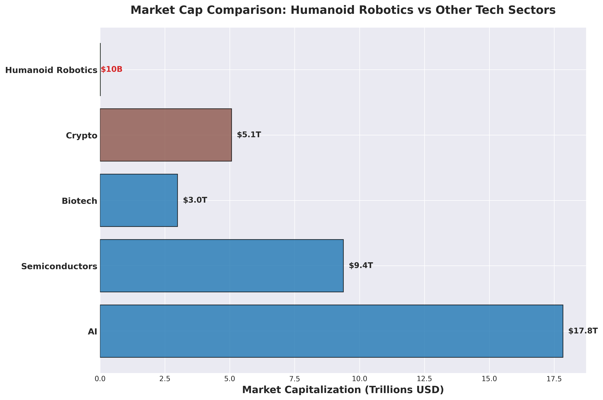
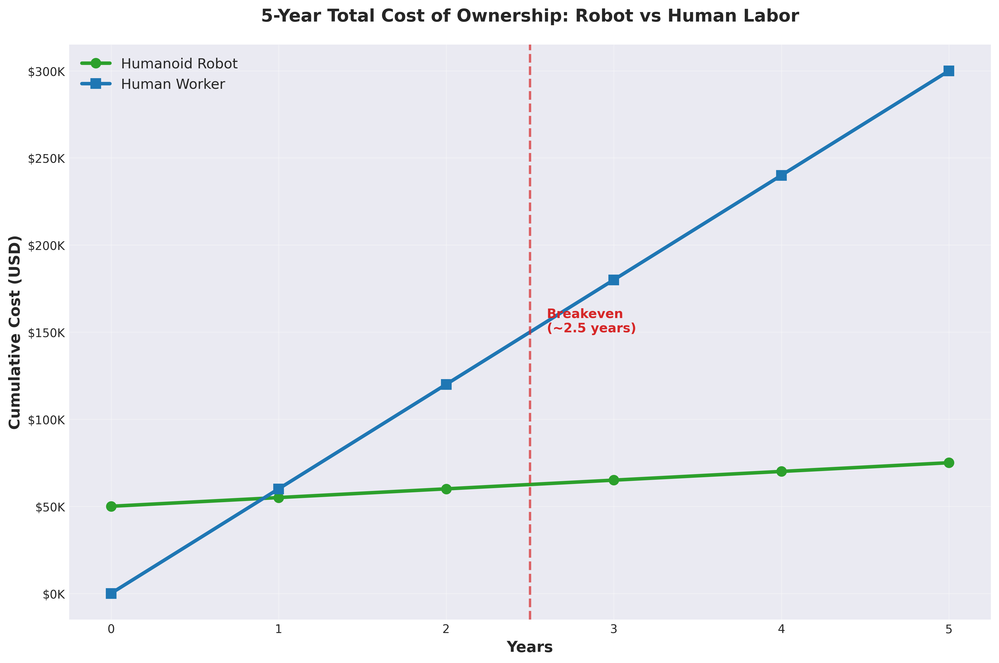
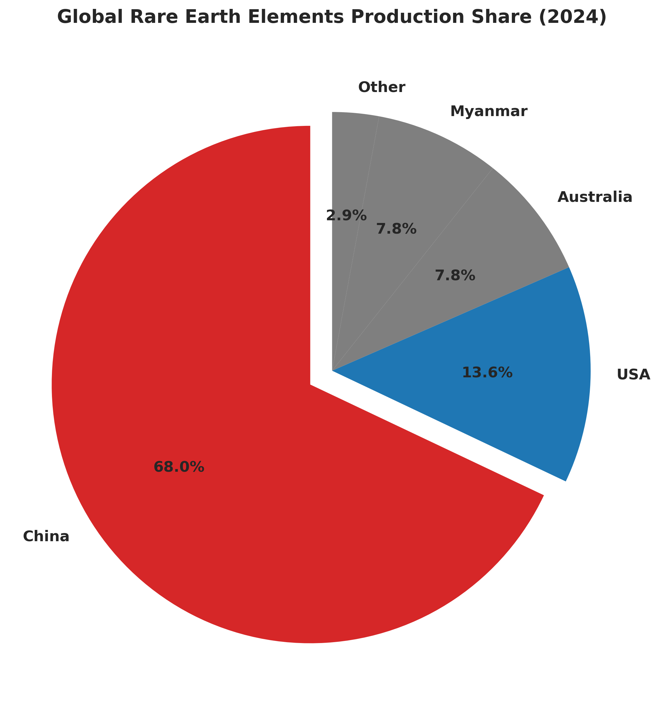
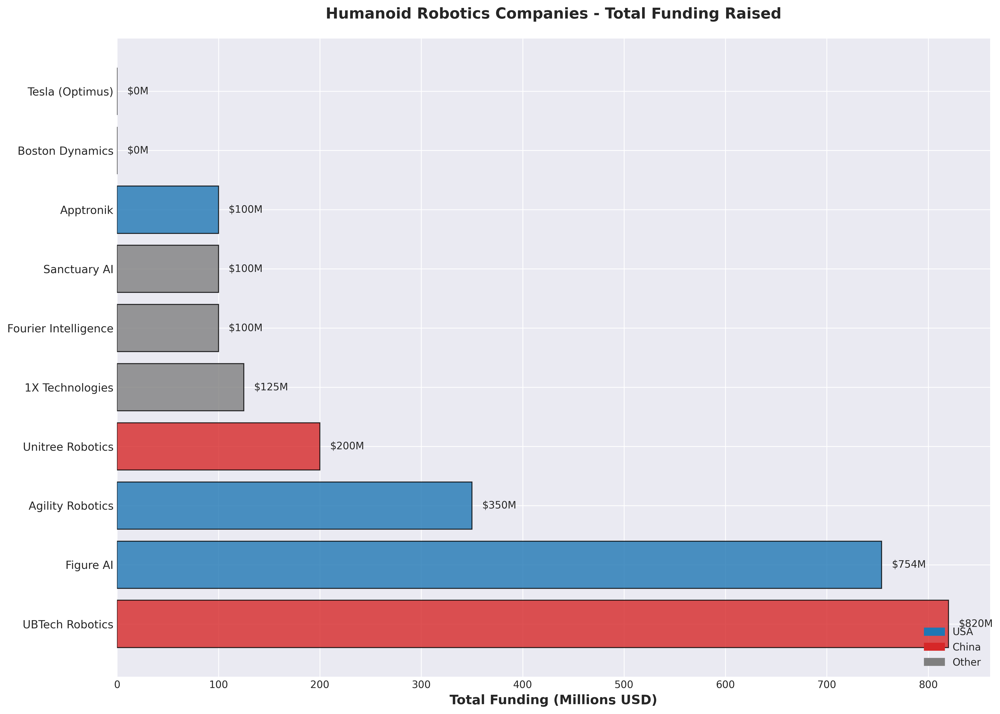
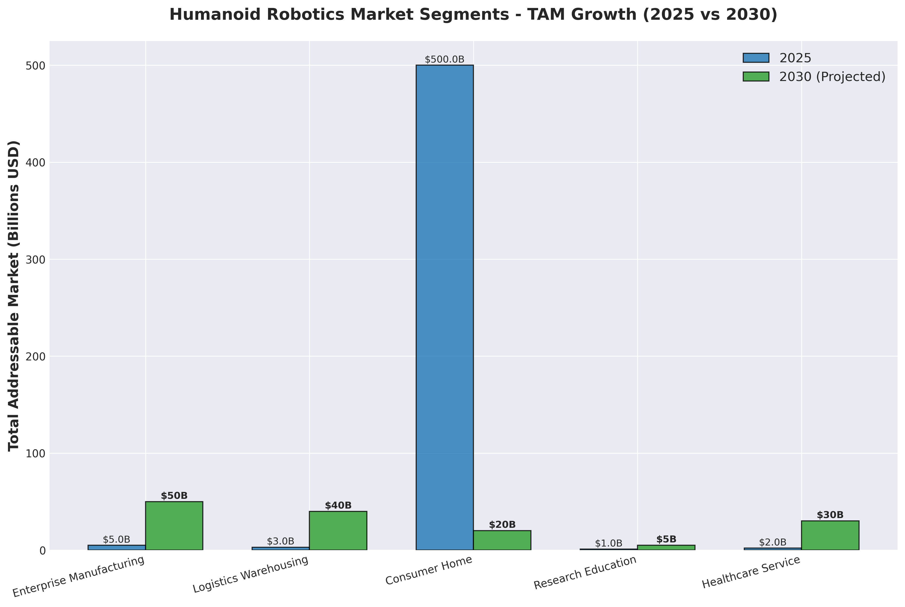

# The $16,000 Robot

*A deep dive on humanoid robotics and China's structural advantage*

---

In 2024, while the investment community fixated on the race between OpenAI and Anthropic, something more fundamental was happening in Hangzhou, China.

Unitree Robotics shipped 10,000 humanoid robots at $16,000 per unit. For context, that's a tenth of what Western competitors are targeting, and they're actually delivering hardware—not prototypes or promises.

The company is preparing for an IPO at a ~$1B valuation in Q4 2025. The market is treating this as a niche industrial opportunity. I think they're missing the bigger picture.

Consider the current market sizing:
- Humanoid robotics today: ~$10B
- Projected 2030: $145B
- AI sector (comparable): $17.8T
- Semiconductor sector: $9.4T

*Humanoid robotics represents 0.06% of the AI sector market capitalization*

If AI is the brain, robots are the body. The discrepancy in market values suggests a mispricing.

---

## The Manufacturing Economics Problem

The challenge with physical AI is fundamentally different from software. A humanoid robot requires:

- 30-40 servo motors with rare earth element magnets
- Real-time vision processing and inference
- Battery systems with sufficient power density
- Mechanical precision at scale
- A price point under $50K to compete with human labor

This is why companies with substantial capital still struggle:
- Figure AI: $754M raised, limited production
- Boston Dynamics: 30+ years of R&D, no mass market product
- Tesla: Unlimited resources, zero external Optimus sales

China solved a different problem: manufacturing economics at scale.

Unitree's $16K price is not a marketing claim—it's achievable because of:

1. Access to rare earth supply chain (China: 70% of global production, 85-90% of processing)
2. Component and labor costs 40-60% lower than Western competitors
3. Government R&D subsidies through MIIT programs ($10B+)
4. Faster iteration cycles (annual updates vs. multi-year development timelines)

The unit economics are straightforward:

**5-Year Total Cost of Ownership:**
- Humanoid robot: $16K upfront + $25K maintenance = $41K
- Human worker: $60K annual × 5 years = $300K
- Payback period: ~2.5 years

*Total cost comparison over 5-year operating period*

At 50% efficiency relative to a human worker, the ROI case still works.

---

## Four Structural Advantages

### 1. Rare Earth Supply Chain Control

Every humanoid robot needs 2-6kg of neodymium for motors. At 100,000 units annually, that's 200-600 tonnes of neodymium per year.

The supply dynamics:
- China: 70% of global REE production
- China: 85-90% of neodymium processing (including U.S.-mined materials)
- Current pricing: $60-70/kg (represents 1-2% of total robot cost)

The risk isn't price—it's supply disruption. China has precedent for restricting exports of strategic materials (gallium and germanium export controls implemented in 2023).

If U.S.-China relations deteriorate further, Western manufacturers face either 50-100% cost increases or production constraints. Chinese manufacturers (Unitree, UBTech, Fourier) maintain structural cost advantage.

*Global rare earth element production distribution*

This is a geopolitical moat, not a technological one.

### 2. Manufacturing Cost Structure

**Western pricing:**
- Figure AI: $100K+ (estimated initial production)
- Boston Dynamics Atlas: $100K+ (not commercially available)
- Tesla Optimus: $20-30K (announced target, unproven)

**Chinese pricing:**
- Unitree G1: $16K (current, shipping)
- UBTech Walker S: $50-100K (estimated)
- Fourier GR-1: $50K+ (estimated)

The cost advantage stems from vertical integration in Shenzhen and Hangzhou supply chains, direct government subsidies, and faster iteration cycles. Unitree ships annual model updates; Western competitors operate on 2-3 year development timelines.

China has executed this playbook before: solar panels, EVs, batteries, drones. Each followed the same pattern—enter at 50-70% lower price, scale production, iterate rapidly, capture market share.

*Total capital raised by humanoid robotics companies*

### 3. Government-Backed Demand

China's Ministry of Industry and Information Technology (MIIT) has set deployment targets:
- 50,000+ humanoid robots by 2025
- 500,000+ by 2027
- Domestic production incentives
- Procurement mandates for Chinese technology

The U.S. has robotics provisions in the IRA and CHIPS Act, but lacks coordinated procurement strategy. Western companies compete for enterprise pilot programs while Chinese manufacturers have guaranteed government demand.

### 4. Production Reality vs. Roadmap

**Currently shipping (2024-2025):**
- Unitree G1: 10,000+ units
- Agility Robotics Digit: 100+ units (Amazon, GXO pilots)
- UBTech Walker S: Deployed in Chinese smart city projects (volume unknown)

**In pilot phase:**
- Figure AI Figure 02: BMW pilot (targeting 100+ units)
- Apptronik Apollo: Mercedes, Walmart pilots (single digits)

**Development/internal only:**
- Tesla Optimus: ~50-100 units in Tesla factories (estimated), zero external sales
- Boston Dynamics Electric Atlas: Hyundai pilots beginning 2025

First-mover advantage matters in hardware: learning curve effects, ecosystem development, supply chain relationships. By the time Western companies reach 10,000 annual units, Chinese manufacturers will be at 100,000+.

---

## Market Segmentation and TAM

Five distinct markets are developing:

| Segment | 2025 | 2030 | CAGR |
|---------|------|------|------|
| Enterprise Manufacturing | $5B | $50B | 58% |
| Logistics/Warehousing | $3B | $40B | 67% |
| Consumer/Home | <$500M | $20B | 100%+ |
| Research/Education | $1B | $5B | 38% |
| Healthcare/Service | $2B | $30B | 72% |
| **Total** | **$11B** | **$145B** | **67%** |

*Projected total addressable market by segment*

Enterprise manufacturing and logistics represent the de-risked opportunity—customers are paying now. Consumer is speculative but represents the largest potential TAM.

---

## Three Scenarios

### Scenario 1: China Scales (60% probability)

Unitree executes on IPO, scales to 100,000 units annually by 2027.

**Math:**
- Revenue: 100K units × $16K ASP = $1.6B
- Gross profit (30% margins at scale): $480M
- Valuation (15x revenue, typical for hardware-SaaS hybrid): $24B
- Current pre-IPO valuation: ~$1B
- **Implied return: 24x over 2-3 years**

**Catalysts:**
- Chinese government procurement guarantees baseline demand
- REE supply advantage maintains cost leadership
- Western competitors cannot match pricing
- Consumer and education markets in China adopt at scale

**Risks:**
- U.S. export restrictions eliminate international markets
- Quality/reliability concerns damage brand perception
- Competitive response from UBTech or other Chinese players

### Scenario 2: Enterprise RaaS Adoption (50% probability)

Figure AI and Agility Robotics prove ROI, enterprise adopts Robot-as-a-Service model at scale.

**Math:**
- RaaS pricing: $3-5K monthly per robot
- Target deployment: 50,000 robots by 2027 (Amazon, BMW, Mercedes, others)
- ARR: 50K × $48K = $2.4B
- Valuation (8x ARR, enterprise SaaS multiple): $19B
- Current valuations: Figure AI $2.6B, Agility $1.5B
- **Implied return: 5-7x combined**

**Catalysts:**
- Labor shortages in logistics and manufacturing persist
- Pilots demonstrate 2-3 year payback (Amazon data emerging)
- OpenAI integration enables autonomous operation beyond teleoperation

**Risks:**
- Technology reliability remains below 90% uptime
- Hidden operational costs destroy ROI case
- Labor union pressure leads to regulatory restrictions

### Scenario 3: Consumer Breakthrough (30% probability)

1X Technologies (Neo) or Tesla Optimus achieves consumer market product-market fit.

**Math:**
- TAM: 140M U.S. households, 5% adoption by 2030 = 7M units
- Market size: 7M × $25K = $175B
- Leader captures 30% share = $52B revenue
- Valuation (2x revenue, hardware multiple): $104B

**Catalysts:**
- Aging demographics drive elder care demand ($150B+ market)
- Single-person household growth creates demand
- Home automation reaches inflection point

**Risks:**
- Technology maturity insufficient for consumer use cases
- Safety and liability concerns (home accidents, child safety)
- Price needs to reach $10-15K for mass adoption

**Expected value calculation:**
- Scenario 1: 60% × 24x = 14.4x
- Scenario 2: 50% × 6x = 3x
- Scenario 3: 30% × 10x = 3x
- **Weighted average: ~20x over 3-5 years**

(Adjusted for correlation and scenario overlap)

---

## Risk Assessment

### Technology Risk (40% probability of moderate impact)

Current generation humanoids achieve 70-85% uptime. Humans: 95%+.

If robots cannot handle edge cases reliably, enterprise pilots fail to convert to production deployments. Boston Dynamics has demonstrated this risk—30 years of R&D has not produced a mass market product. Autonomous vehicles follow a similar pattern: promised delivery in 2018, still limited deployment in 2025.

Many "autonomous" robots remain teleoperated. If AI cannot enable true autonomy, the value proposition weakens significantly.

Base case: Technology works but takes 2x longer than optimistic timelines suggest.
Tail risk: Fundamental limitations prevent commercial viability. 20% probability.

### Geopolitical Risk (30-40% probability)

U.S.-China decoupling accelerates:
- U.S. bans Chinese humanoid robots (national security rationale)
- China restricts REE exports (retaliation)
- Western manufacturers face supply chain disruptions

Result: Market fragments. Unitree loses U.S. and EU markets (40% of global TAM). Western companies face 2-3x cost increases. Total addressable market shrinks as both ecosystems struggle independently.

### Tesla Execution Risk (15% probability)

Tesla focuses resources on Optimus, ships 1M units by 2028.

The company has manufacturing scale expertise (2M+ vehicles annually), world-class AI from FSD development, and vertical integration in chips, batteries, and software. At $20K pricing with superior quality, Tesla could consolidate the market.

Counterargument: Elon's track record on timelines is poor (FSD "next year" since 2016, multiple product delays), and Optimus appears to be priority #8 behind Tesla automotive, SpaceX, X, Neuralink, xAI, and Boring Company. Zero external sales after 2+ years of development suggests execution challenges.

### Regulatory Risk (25% probability)

Labor unions lobby governments, safety incidents create public backlash, or AI pause sentiment extends to physical AI.

Precedent exists: EU AI Act classifies robots as high-risk applications. California has implemented autonomous vehicle restrictions. GMO crops and nuclear energy demonstrate that beneficial technologies can face extended regulatory barriers.

If Western markets implement restrictive regulation while China does not, the market bifurcates with Chinese companies capturing faster growth.

---

## Current Market Valuation

**Public companies:**
- Tesla (includes Optimus): $1.48T
- UBTech Robotics (9888.HK): $357B
- BYD (robotics division): $962B

**Private companies:**
- Figure AI: $2.6B
- Agility Robotics: ~$1.5B
- Unitree: ~$1B (pre-IPO estimate)
- 1X Technologies: $600M
- Others: $3B+

**Total humanoid robotics (excluding Tesla): ~$10B**

**Comparable sectors:**
- AI: $17.8T
- Semiconductors: $9.4T
- Biotech: $3T
- Crypto: $5T

Humanoid robotics represents 0.06% of AI sector market capitalization. If robots are the physical manifestation of AI—the mechanism by which AI acts in the physical world—current valuations appear inconsistent.

At 5-10% of AI sector valuation, humanoid robotics would be $1-2T. That implies 100-200x growth from current base. Even capturing 10% of that opportunity represents 10-20x returns.

---

## Monitoring Framework

I don't have direct exposure to most of these companies (private), but I'm watching specific signals:

**Validating signals:**
- Unitree IPO succeeds, trades above issue price
- Figure AI converts BMW pilot to multi-year production contract
- Agility deploys 1,000+ Digit robots at Amazon facilities
- China announces expanded procurement targets
- REE prices remain stable (no supply disruption)

**Invalidating signals:**
- Enterprise pilots fail to convert (ROI case breaks)
- UBTech stock declines post-IPO (market rejects robotics thesis)
- U.S. implements Chinese robot ban; China restricts REE exports
- Tesla ships 10,000+ Optimus units to external customers (execution risk materializes)
- Multiple safety incidents drive regulatory crackdown

Quarterly updates as data becomes available.

---

## Conviction Level

**7/10**

The asymmetry is compelling. China has structural advantages in supply chain, manufacturing, and government support that are difficult to replicate. Western enterprise companies are demonstrating ROI in real deployments. Unit economics work at current pricing.

Primary risks: Technology may not achieve required reliability (40% probability of delays), geopolitical decoupling could fragment markets (30-40% probability), and regulatory response could slow Western adoption (25% probability).

If one of three scenarios materializes—China scales, enterprise RaaS succeeds, or consumer breaks through—returns could be substantial. Unlike software, hardware requires manufacturing infrastructure, creating a natural moat for first movers.

The market is pricing humanoid robotics at $10B. A $50-100B market by 2030 (base case) represents 5-10x. A $200B+ market (bull case) represents 20x+.

---

## Public Market Access

**UBTech (9888.HK):** First pure-play humanoid robotics stock. Chinese domicile creates geopolitical risk and potential delisting risk. Government contracts provide revenue visibility.

**Tesla (TSLA):** Optimus represents optionality on $1.5T car company. Paying for automotive business with free option on robotics. Execution risk is high.

**Intuitive Surgical (ISRG):** Surgical robotics, different market but proven business model with operating leverage. Demonstrates that robotics can scale profitably.

Private market opportunities (Unitree, Figure AI, Agility) require accredited investor status and access to late-stage venture rounds.

---

## Full Analysis

Data, scripts, and detailed company breakdowns available at:
[GitHub - HumanoidRobotics](https://github.com/ykdojo/youtube-summarizer-mcp/tree/main/deep_dives/HumanoidRobotics)

Includes:
- Company tracker (10 humanoid robotics players)
- Market data collection scripts (reproducible)
- Rare earth supply chain analysis
- Competitive positioning models
- TAM projections by segment

---

*Disclaimer: Not investment advice. Most companies mentioned are private and inaccessible to retail investors. Conduct independent research.*

**Data sources:** Crunchbase, company filings, Yahoo Finance, USGS, Trading Economics
